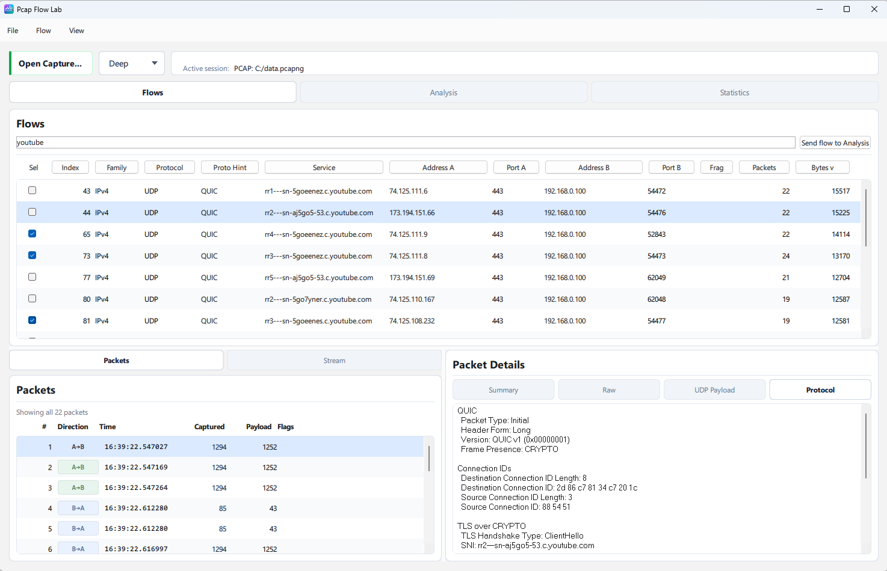
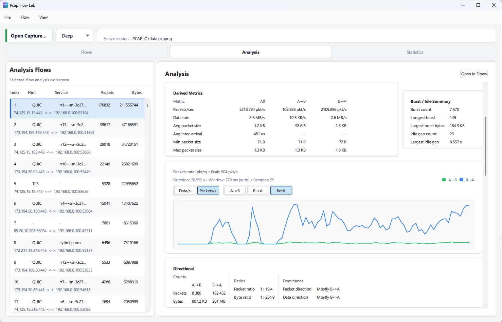
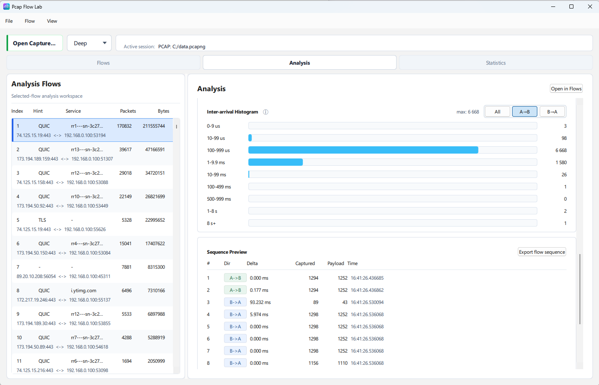
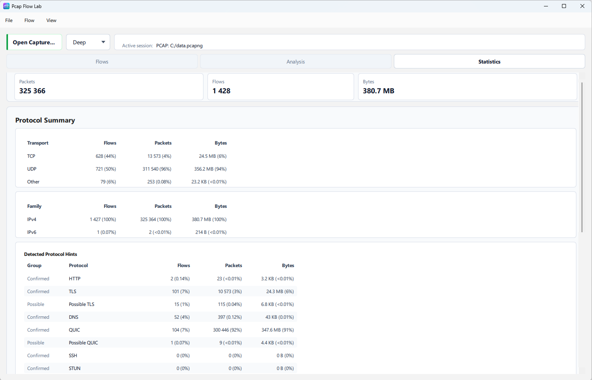
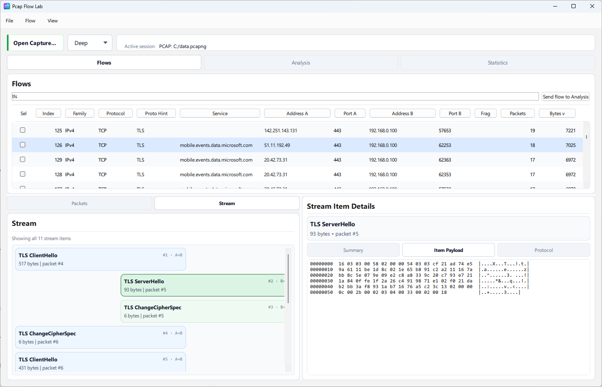

# Pcap Flow Lab

**Flow-first PCAP analyzer for large captures.**

Pcap Flow Lab is an open-source C++20 project with a CLI and an optional Qt Quick desktop UI. It is designed for a specific workflow: open large captures quickly, navigate by flow instead of packet-first hunting, save reusable indexes, and inspect only the selected flow in more detail when that deeper work is worth doing.

It is not trying to be a Wireshark replacement. It is trying to be a practical flow-oriented tool for large capture exploration that stays fast, bounded, and honest about its limits.

<p align="center">
	
</p>

## Why this project exists

Large captures are often awkward to revisit when every session starts with a full rescan and packet-by-packet re-orientation. Pcap Flow Lab focuses on a different workflow:

- open captures with a packet-oriented fast path
- persist reusable analysis indexes so large captures do not need to be fully re-imported every time
- browse and filter flows first
- inspect packets, details, statistics, and selected-flow analysis only where needed
- export useful subsets without turning the whole product into a general-purpose protocol workbench

This makes the project especially useful when the first question is not "what does packet 1 contain?" but "which flows matter in this capture, and what is the shape of the one I care about?"

## How it differs from Wireshark

Pcap Flow Lab deliberately optimizes for a narrower job than Wireshark.

- It is flow-first rather than packet-first.
- It emphasizes large-capture usability and index-based reopen workflows.
- It keeps deeper work selected-flow-only instead of doing global stream reconstruction during open.
- It aims for practical, bounded inspection rather than maximum protocol breadth.

That also means it intentionally does not compete on every axis:

- it is not a full protocol forensics suite
- it does not try to match Wireshark packet-detail depth
- it does not implement full TCP-correct reconstruction for hostile capture conditions

## Key features

- Fast open path for PCAP and PCAPNG captures.
- Reusable analysis indexes for large files.
- Index-only reopen workflow with later source-capture attach for byte-dependent features.
- Flow browsing with filtering, protocol hints, top endpoints, top ports, and protocol statistics.
- Selected-flow Analysis workspace with metadata-first summaries, derived metrics, histograms, timeline, directional ratios, and rate graph.
- Selected-flow Stream inspection for practical TCP, TLS, HTTP, and narrow QUIC cases.
- Packet details in Summary, Raw, and Protocol views.
- Flow export to classic PCAP and selected-flow sequence export to CSV.
- Conservative behavior on imperfect captures, including bounded fallback paths instead of over-claiming semantic certainty.

## Screenshots

### Flows overview



### Analysis workspace





### Statistics summary



### Stream and details



## Current scope and limitations

The current project direction is suitable for an initial `v0.1.0` release if the core workflows are solid and the limitations stay explicit.

Current strengths:

- practical flow navigation on large captures
- fast open plus reusable index reopen workflows
- selected-flow Analysis from metadata only
- useful selected-flow Stream behavior for supported TCP, TLS, HTTP, and narrow QUIC cases

Current limitations:

- no full TCP-correct stream reconstruction
- no deep TCP recovery after gaps, major reordering, or loss
- Stream results are heuristic and can differ from Wireshark on difficult captures
- HTTP Stream handling is focused on header blocks, not full body reconstruction
- QUIC handling is intentionally narrow and not session-complete
- packet details are intentionally shallower than Wireshark
- index and checkpoint loading currently use an exact-version policy

## Supported formats and protocol scope

Current decode and import support includes:

- classic PCAP and current PCAPNG
- Ethernet II
- Linux cooked captures `SLL` and `SLL2`
- up to two VLAN tags
- ARP
- IPv4 and IPv6
- ICMP and ICMPv6
- TCP and UDP
- conservative traversal of common IPv6 extension headers
- always-on IP fragmentation detection as diagnostic metadata

Current protocol-aware inspection is strongest in:

- HTTP request and response header-block recognition with bounded directional reassembly
- TLS record-oriented Stream parsing with bounded directional reassembly
- narrow TLS detail exposure for complete `ClientHello`, `ServerHello`, and `Certificate` cases
- narrow selected-flow QUIC labeling for practical packet-aware cases such as `Initial`, `Handshake`, `Retry`, `Version Negotiation`, `CRYPTO`, `ACK`, and protected payload fallback

## Build and platform status

Requirements:

- CMake `3.24+`
- a C++20 compiler
- Qt `6.8+` with `Quick`, `Qml`, `QuickControls2`, and `Widgets` for the desktop UI

The CLI and core library can build without Qt. If Qt 6 is not found, the UI target is skipped.

Example configure and build steps:

```sh
cmake -S . -B build -DCMAKE_BUILD_TYPE=Release
cmake --build build --config Release
```

If `BUILD_TESTING` is enabled, the repository defines:

- `pcap_flow_lab_core_tests`
- `pcap_flow_lab_ui_tests` when the Qt UI target is available

Example test command:

```sh
ctest --test-dir build --output-on-failure --build-config Release
```

Current checked workflow in the repository is a Windows-oriented development path. Treat broader platform coverage as best-effort unless release notes explicitly say a platform or workflow was checked for that release.

## Quick usage examples

```sh
pcap-flow-lab summary sample.pcap --mode fast
pcap-flow-lab flows sample.pcapng --mode deep
pcap-flow-lab summary sample.idx
pcap-flow-lab inspect-packet sample.idx --packet-index 0
pcap-flow-lab export-flow sample.idx --flow-index 0 --out selected-flow.pcap
pcap-flow-lab save-index sample.pcapng --out sample.idx --mode deep
pcap-flow-lab load-index-summary sample.idx
pcap-flow-lab chunked-import sample.pcap --checkpoint sample.ckp --max-packets 100000
pcap-flow-lab resume-import --checkpoint sample.ckp --max-packets 100000
pcap-flow-lab finalize-import --checkpoint sample.ckp --out sample.idx
```

If the Qt UI target is built, run:

```sh
pcap-flow-lab-ui
```

## Related docs

- [docs/architecture.md](docs/architecture.md): architecture, persistence boundaries, and runtime paths
- [docs/current-state.md](docs/current-state.md): implemented behavior and current gaps
- [docs/roadmap.md](docs/roadmap.md): practical engineering roadmap
- [docs/release-checklist-v0.1.0.md](docs/release-checklist-v0.1.0.md): first public release readiness checklist
- [docs/contributing.md](docs/contributing.md): contribution expectations

## License

This project is licensed under the Apache License 2.0. See [LICENSE](LICENSE).

## Developer note

Creating `perf-open.enabled` next to the executable or in the current working directory enables append-only open-time CSV logging to `perf_open_log.csv` for `capture_fast`, `capture_deep`, and `index_load` operations. This is developer-only instrumentation for local regression tracking and has no effect in normal usage.


