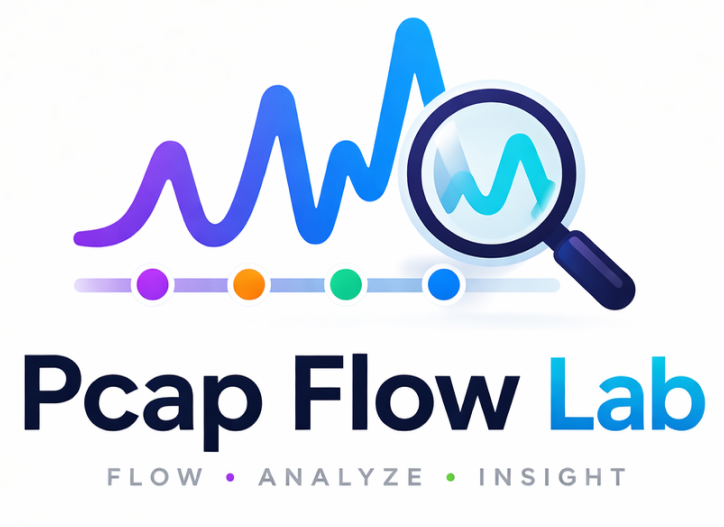
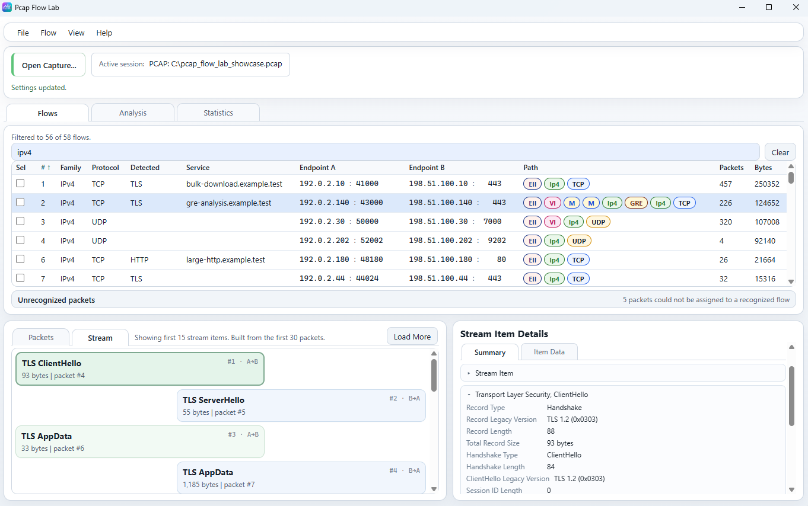
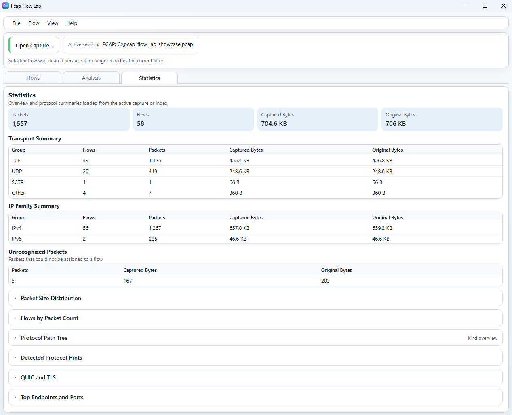
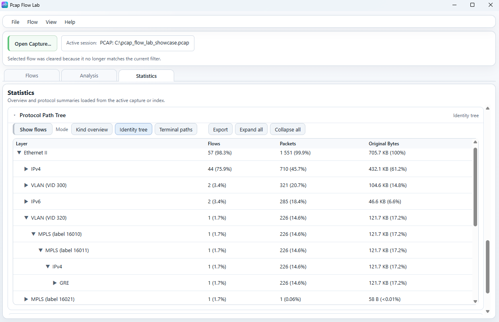

# Pcap Flow Lab

**A flow-based PCAP analyzer.**

Pcap Flow Lab is an open-source C++ application for analyzing packet captures
through a flow-based model. Instead of treating individual packets as the
primary navigation unit, it organizes traffic into flows and lets you move from
one selected flow into packets, protocol Stream inspection, per-flow Analysis,
and capture-wide Statistics.

Qt is the primary desktop UI. The project also includes a CLI and an
experimental Tauri desktop frontend built on the same core analysis and
presentation model. Pcap Flow Lab is not a Wireshark replacement; it provides a
different flow-based view of the same traffic and complements deep packet-based
inspection workflows.

<p align="center">
  
</p>

## A different view of packet captures

The interesting first question in a capture is often not "what is in packet 1?"
but "which flows matter here, and what is happening inside the one I care
about?"

Pcap Flow Lab is built around that workflow:

- organize traffic into flows
- filter and compare flows
- inspect packets or Stream only where needed
- analyze one selected flow
- inspect whole-capture Statistics
- preserve meaningful encapsulation context
- export the relevant subset when you are done

Wireshark remains the stronger deep packet-based protocol analyzer. Pcap Flow
Lab focuses on flow navigation, selected-flow analysis, Protocol Path-aware
identity, bounded Stream inspection, reusable indexes, capture-wide Statistics,
and targeted packet inspection. When you want to pivot from one tool to the
other, Pcap Flow Lab can generate a Wireshark display filter for the selected
flow.

Pcap Flow Lab is also designed to remain practical on very large captures.
Expensive inspection is bounded and performed on demand rather than globally
materialized during capture open. The Qt application has been tested with real
capture files measuring several tens of gigabytes, and observed memory use
remained well below the capture size.

## Try Pcap Flow Lab

Want to explore the application without finding a capture first?

Download the [Pcap Flow Lab showcase capture](examples/showcase/pcap_flow_lab_showcase.pcap).
It is a small, versioned sample capture intended specifically for demonstrating
Pcap Flow Lab, with representative flows for packet inspection, Stream
inspection, Analysis, Statistics, Protocol Path identity, application
protocols, tunnels, and selected edge cases.

Open it directly in either desktop application or use it with the CLI. See the
[showcase guide](examples/showcase/README.md) for suggested scenarios.

## Explore captures by flow


The Flows workspace is the main entry point. It gives you a flow table with
endpoints, detected protocol, service metadata, Protocol Path, and packet and
byte totals. Selecting one flow opens its packet sequence, updates Packet
Details, and gives you a direct path into Stream and Analysis without losing
the larger capture context.

Packet Details stays focused on the selected packet. `Summary` explains the
packet structurally, and `Bytes` exposes authoritative packet and derived byte
views for the current selection.

Qt is the primary UI. Some screenshots below use the experimental Tauri
frontend because its compact layout shows the same workflows more clearly.

## Inspect protocol Streams



Packet boundaries are not always the most useful semantic unit. The selected
flow Stream can expose higher-level directional items when that improves the
story the traffic is telling.

Supported structured cases currently include HTTP, DNS/mDNS, TLS, and bounded
QUIC, with generic transport fallback when no deeper specialized Stream parser
is available. A Stream item can come from one packet or from authoritative
reconstructed bytes contributed by multiple packets, but the reconstruction
stays bounded and selected-flow-oriented rather than becoming global session
materialization.

When an item has one authoritative item-owned byte sequence, Stream Item
Details can show `Item Data` and export those bytes directly. When that
ownership is not available, the item can still remain useful in `Summary`.

## Analyze one flow


Analysis is the quantitative workspace for one selected flow. It summarizes
totals, timing, protocol metadata, rates, directionality, burst and idle
behavior, packet-size distributions, inter-arrival information, and sequence
context.

This work is computed on demand for the selected flow rather than globally for
every flow during capture open. That keeps the main open path practical while
still giving you a much richer view once you decide which flow deserves deeper
attention.

## Understand the whole capture



Statistics is the capture-wide or index-wide view. Where Analysis explains one
selected flow, Statistics explains the active capture as a whole.

It brings together:

- capture totals
- transport and IP summaries
- packet and flow distributions
- detected protocol statistics
- QUIC and TLS summaries
- top endpoints and ports
- Protocol Path aggregation

### Protocol Path



Protocol Path is one of the most distinctive parts of Pcap Flow Lab. An
effective IP and transport tuple is not always enough to distinguish traffic
correctly; encapsulation context can be part of identity too.

That context can include layers and identifiers such as:

- VLAN VID
- MPLS label
- VXLAN VNI
- Geneve VNI
- GTP-U TEID
- GRE key
- IPsec identity where applicable

Identifier-aware Protocol Path Statistics makes that structure visible at the
capture level, and matching Protocol Path results can be sent back to the Flows
workspace for focused inspection.

## Key capabilities

- Flow-based PCAP and PCAPNG analysis.
- Qt desktop UI, CLI, and an experimental Tauri frontend sharing the same core
  analysis model.
- Protocol Path-aware flow identity that can preserve meaningful encapsulation
  context.
- Structured selected-packet `Summary` and authoritative `Bytes`.
- Bounded protocol-aware selected-flow Stream with `Summary` and `Item Data`
  where authoritative bytes exist.
- On-demand selected-flow Analysis for timing, rates, distributions, and
  sequence context.
- Capture-wide Statistics, including Protocol Path aggregation.
- Reusable indexes so processed captures can be reopened without starting from
  raw import every time.
- Smart Export and per-flow export workflows for targeted packet extraction.
- Conservative handling of malformed, truncated, and incomplete packet data.

## Reopen captures without starting over

After processing a raw capture, Pcap Flow Lab can save an analysis index.
Reopening that index reuses the previously materialized flow inventory,
metadata, and Statistics instead of rescanning the raw capture from the
beginning.

When byte-backed workflows are needed later, the original source capture can
still provide bytes for Packet Details `Bytes`, Stream item materialization, and
export actions.

## Command-line interface

Pcap Flow Lab includes a CLI for terminal-oriented inspection and export. The
current public command areas cover capture summaries, flow listing and
selection, per-flow detail inspection, packet detail inspection, and export:
`summary`, `flows`, `flow-info`, `packet-info`, and `export-flows`.

```sh
pcap-flow-lab flows capture.pcap --filter TLS --sort bytes:desc
```

## Protocol support

Pcap Flow Lab supports flow-based analysis for `PCAP` and `PCAPNG`, including
common link, network, transport, encapsulation, and application protocols used
in modern packet captures. Current families include PCAP / PCAPNG, Ethernet and
Linux cooked captures, VLAN / MPLS, IPv4 / IPv6, TCP / UDP / SCTP, GRE /
IP-in-IP, VXLAN / Geneve / GTP-U, AH / ESP, HTTP, DNS / mDNS, TLS, QUIC, and
additional recognition for other common application protocols.

Support depth varies by protocol. Some protocols participate in flow identity,
some expose structured Packet Summary, some expose Stream semantics, and some
provide recognition or service metadata only. For user-facing workflow guidance,
start with the [user documentation landing page](user_docs/README.md).

## Current scope

Pcap Flow Lab 0.3.0 is intentionally focused:

- Qt is the primary desktop UI.
- Tauri is an experimental alternative frontend, not a perfect feature-parity
  target.
- The product complements Wireshark instead of replacing deep packet-based
  dissection.
- Stream and deeper inspection stay bounded and selected-flow-oriented rather
  than trying to globally reconstruct everything during capture open.
- Pcap Flow Lab is not a full TCP recovery or reassembly engine for difficult
  capture conditions.
- QUIC support does not attempt complete session reconstruction or general
  application-data decryption.
- Protocol coverage is conservative and explicit about uncertainty on malformed,
  truncated, or partial data.

## Build and releases

Requirements:

- CMake 3.24 or newer
- a C++20 compiler
- Qt 6.8 or newer with `Quick`, `Qml`, `QuickControls2`, and `Widgets` for the
  primary desktop UI

For Pcap Flow Lab 0.3.0, four prebuilt application archives are planned:

- Windows Qt
- Windows Tauri
- Ubuntu Qt
- Ubuntu Tauri

Windows has prebuilt Qt and Tauri applications. Ubuntu has prebuilt Qt and
Tauri applications. macOS users build from source. Other Linux distributions
build from source.

Qt remains the primary desktop UI. Tauri remains an experimental alternative
frontend.

Release downloads are published through the GitHub releases page:
[Pcap Flow Lab releases](https://github.com/AlexeyVasilev/PcapFlowLab/releases)

The CLI and core library can build without Qt. If Qt 6 is not found, the Qt UI
target is skipped.

Typical source build:

```sh
cmake -S . -B build -DCMAKE_BUILD_TYPE=Release
cmake --build build --config Release
```

See the [source build guide](user_docs/build-from-source.md) for Windows,
Ubuntu, macOS, Tauri, and platform prerequisites.

### Tauri frontend

The experimental Tauri frontend requires the Rust toolchain, Tauri tooling, and
platform-specific native build dependencies. After prerequisites are installed,
the current release build command is:

```sh
cd experimental/tauri-ui-spike/src-tauri
cargo tauri build
```

## Documentation

- [User documentation](user_docs/README.md)
- [Desktop UI guide](user_docs/ui/README.md)
- [CLI guide](user_docs/cli/README.md)
- [Settings reference](user_docs/reference/settings.md)

## License

This project is licensed under the Apache License 2.0. See [LICENSE](LICENSE).
