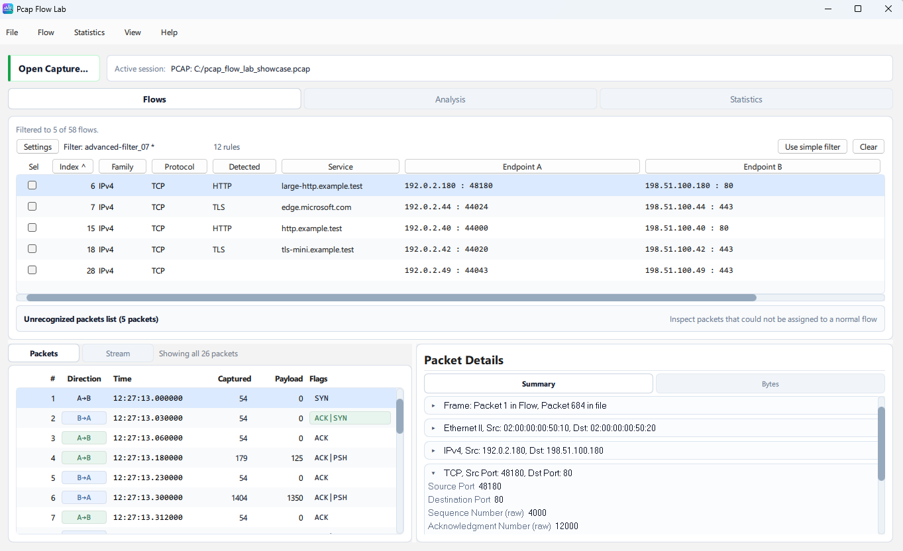
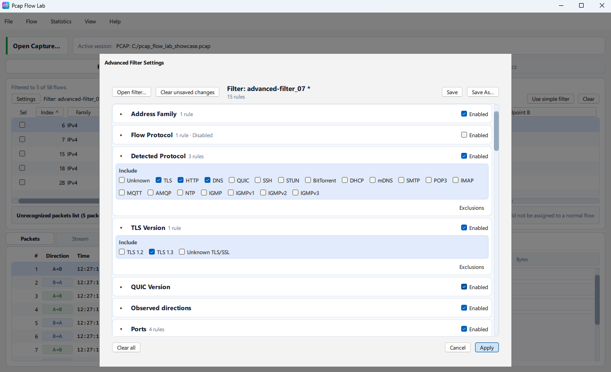
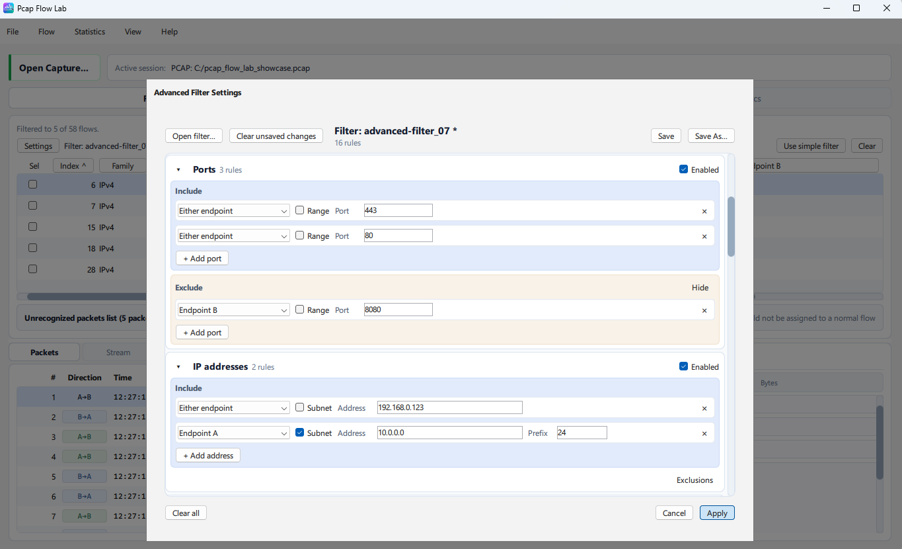
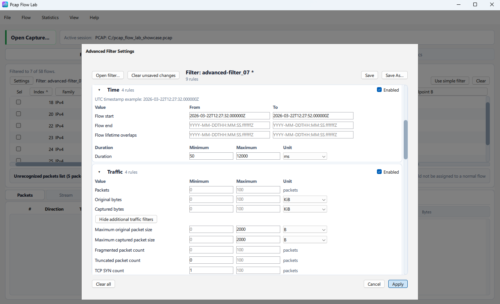
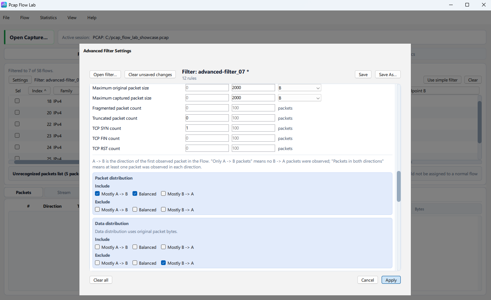
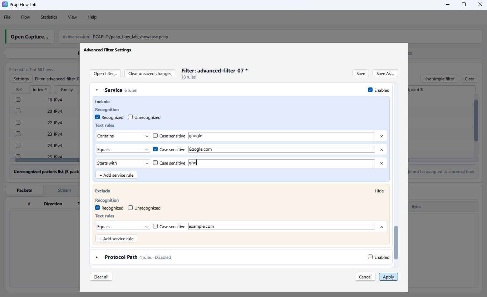
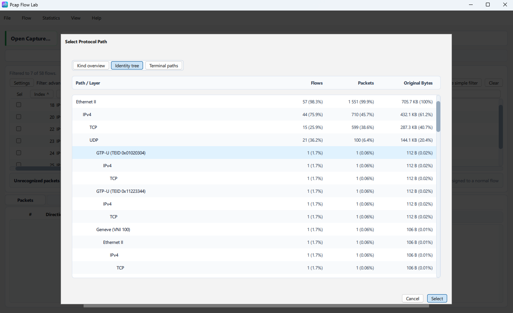
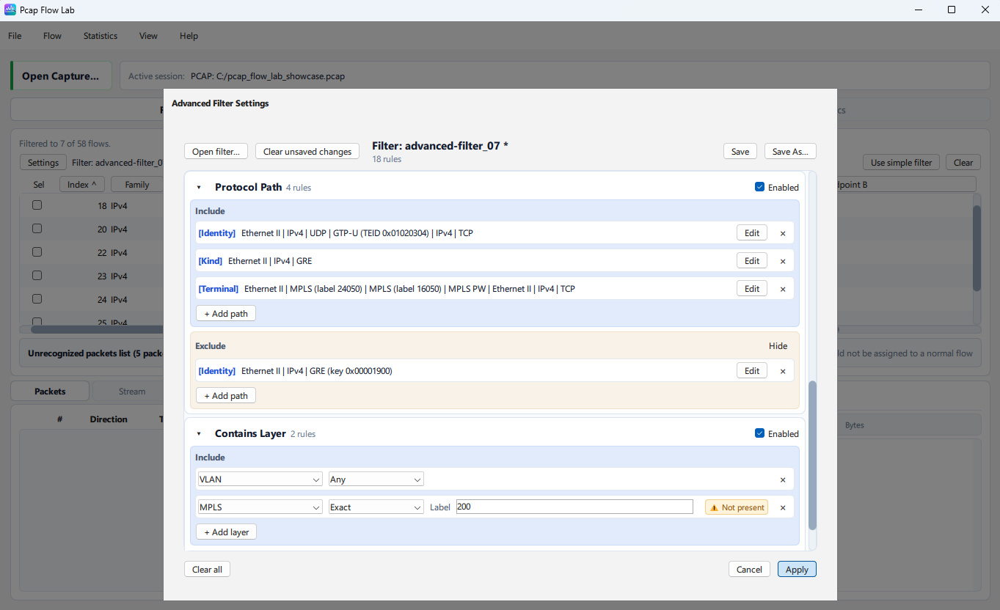

# Advanced Flow Filter

Advanced Flow Filter is the structured filtering mode for the `Flows`
workspace. Use it when a simple text search is not precise enough and you want
to filter by Flow metadata such as protocols, endpoints, ports, time ranges,
traffic totals, Protocol Path, or directional behavior.

For the general Flows workspace, packet inspection, Stream inspection, and
Bytes workflow, see [Flows workspace](flows.md). For export actions that can use
the current filter, see [Flow actions](flow-actions.md). If you use the CLI,
see [`flows`](../cli/flows.md).

## Simple Filter and Advanced Filter

The Flows workspace has two primary filter modes:

- `Simple Filter`
- `Advanced Filter`

`Simple Filter` is the fast text search above the Flow List. It performs
lightweight case-insensitive matching over common displayed Flow fields such as
protocol, detected protocol, service, address, and port text.

`Advanced Filter` applies structured conditions to Flow metadata. It is useful
for range filters, direction-aware filters, time windows, Protocol Path
matching, and aggregate traffic questions.

The two modes are mutually exclusive. Pcap Flow Lab does not apply the Simple
Filter text and Advanced Filter document together. Switching away from one mode
does not destroy its inactive state:

- returning to Simple Filter restores the existing Simple Filter text;
- returning to Advanced Filter restores the currently applied Advanced Filter.

## Open Advanced Mode

The normal desktop workflow is:

```text
Flows
-> Use advanced filter
-> Settings
-> configure sections
-> Apply
-> Flow List updates
```

In Advanced mode, the compact toolbar shows the main controls for the current
filter:

| Control | Purpose |
| --- | --- |
| `Settings` | Open the structured Advanced Filter editor. |
| `Filter: <name>` | Show `Custom filter` or the loaded `.filter` filename. |
| rule count | Show the active atomic rule count for the effective filter. Qt may render this as `N rules`. |
| `Use simple filter` | Switch back to Simple Filter mode. |
| `Clear` | Clear the current Advanced Filter state, with confirmation when unsaved configuration would be lost. |



The detailed editor is shown in `Advanced Filter Settings`. It is separate from
the Flow table so the Flow List remains usable at normal width.

Rule count wording can differ slightly by frontend. Settings may expose both
configured and active counts. Tauri Settings currently renders them explicitly:

```text
7 configured · 5 active
```

`configured` means all configured atomic predicates retained in the filter
document, including predicates retained inside disabled sections. `active`
means configured predicates belonging to enabled sections; these contribute to
the effective filter.

Individual section headers can also summarize their configured rule count and
show `Disabled` when the section is temporarily off.

## How Conditions Combine

The most important rule is:

```text
different active sections combine with AND
```

Within one section, multiple Include choices usually combine with OR. Matching
an active Exclude rejects the Flow. Empty sections impose no restriction.
Disabled sections keep their configuration but do not participate in matching.

Example:

```text
Flow Protocol:
    Include TCP, UDP

Ports:
    Include Either endpoint 443
```

This means:

```text
(TCP OR UDP) AND port 443
```

Exclusions are not a second include group. For example, `Detected Protocol:
Exclude DNS` means any DNS Flow is rejected even if other sections match.

Two sections have more specialized user-visible behavior:

- `Service` can combine recognized/unrecognized state with text rules.
- `Protocol Path` and `Contains Layer` are separate sections. If both are
  enabled, a Flow must satisfy both.

## Section Enabled State

Each Advanced Filter section has its own Enabled state.

Disabling a section:

- temporarily removes that section from the effective filter;
- keeps the section's configured values in the document;
- preserves those values when the filter is saved;
- lets you re-enable the section later without re-entering its rules.

Disabling a section is not the same as deleting its rules. `Clear all` is
different: it removes configured predicates from the current filter state.

Disabled sections still keep their configured rule count, but their rules do
not contribute to the active count until the section is enabled again.



## Address Family

Use `Address Family` to include or exclude IPv4 and IPv6 Flows.

Typical uses:

- Include `IPv4` when you want only IPv4 Flows.
- Include `IPv6` when you want only IPv6 Flows.
- Exclude `IPv6` when you want to remove IPv6 while keeping every other active
  filter condition.

If neither IPv4 nor IPv6 is selected in the section, Address Family imposes no
restriction.

## Flow Protocol and Detected Protocol

`Flow Protocol` and `Detected Protocol` answer different questions.

`Flow Protocol` is the protocol identity used for the Flow itself. Common
examples are TCP, UDP, SCTP, ICMP, ICMPv6, IGMP, ESP, ARP, or Unknown.

`Detected Protocol` is higher-level classification metadata such as TLS, HTTP,
DNS, mDNS, QUIC, SSH, STUN, BitTorrent, DHCP, SMTP, POP3, IMAP, MQTT, AMQP, NTP,
IGMP, IGMPv1, IGMPv2, or IGMPv3.

Selecting a detected protocol does not guarantee that every downstream Packet
Details or Stream workflow has a dedicated parser for that protocol. It means
the Flow has that currently known classification.

Both sections support Include and Exclude.

## TLS Version and QUIC Version

Use these sections when you want to filter by Flow-level TLS or QUIC version
metadata.

Current TLS version choices include:

- `Unknown TLS/SSL`
- `TLS 1.2`
- `TLS 1.3`

Current QUIC version choices include:

- `Unknown`
- `QUIC v1`
- `QUIC draft-29`
- `QUIC v2`

These filters use currently known Flow metadata. They do not perform arbitrary
source-packet rescanning, complete protocol reconstruction, or decryption.

The unknown choices are metadata states. They should not be read as proof that
a Flow is not TLS or not QUIC; they mean the relevant version was not known in
the stored Flow metadata.

## Observed Directions

Use `Observed directions` to filter by whether packets were seen in one or both
stored Flow directions.

Current choices are:

| Choice | Meaning |
| --- | --- |
| `Only A -> B packets` | Packets were observed only in the first-observed direction. |
| `Packets in both directions` | At least one packet was observed in each direction. |

`A -> B` is the direction of the first observed packet used to establish
Endpoint A and Endpoint B orientation. It does not mean client to server.

This same A/B orientation is used by directional Traffic predicates.

## Ports

Use `Ports` to match exact ports or port ranges.

Each row has an endpoint scope:

- `Either endpoint`
- `Endpoint A`
- `Endpoint B`

`Endpoint B, Port 443` is not equivalent to `Either endpoint, Port 443`.
Endpoint A and Endpoint B are stored Flow orientation, so endpoint scope matters
when you care which side carried the port.

Rules:

- exact port values must be in `0..65535`;
- port ranges must have `From <= To`;
- Include rows match when any include row matches;
- Exclusions reject a Flow when any exclusion row matches;
- rows can be added and removed independently.

## IP Addresses and Networks

Use `IP addresses` to match endpoints by address or subnet.

Each row has an endpoint scope:

- `Either endpoint`
- `Endpoint A`
- `Endpoint B`

The editor supports:

- exact IPv4 addresses;
- exact IPv6 addresses;
- subnet mode with an address and prefix;
- Include rows;
- Exclusions.

Prefix ranges are:

- IPv4: `0..32`
- IPv6: `0..128`

For exact addresses, use the normal exact-address mode. You do not need to type
`/32` or `/128` just to match one address.



## Time

Use `Time` when you care where a Flow sits in the capture timeline.

The current time section exposes these controls:

| Control | What it matches |
| --- | --- |
| `Flow start` | Flows whose first packet occurred inside the requested range. |
| `Flow end` | Flows whose last packet occurred inside the requested range. |
| `Flow lifetime overlaps` | Flows whose lifetime intersects the requested interval. |
| `Duration` | Flows by elapsed time between first and last packet. |

Examples:

- `Flow start` from `2026-03-22T12:00:00.000000Z` to
  `2026-03-22T12:05:00.000000Z` matches Flows that began during that
  five-minute UTC window.
- `Flow end` with the same range matches Flows that ended during that window,
  even if they started earlier.
- `Flow lifetime overlaps` with the same range matches a Flow that was active
  at any point in that window, even if it started before or ended after it.
- `Duration` matches by `last packet time - first packet time`.

A one-packet Flow has duration `0`.

Current timestamp fields use complete absolute UTC `Z` timestamps such as
`2026-03-22T12:00:00.000000Z`. The UI does not currently provide local-time or
capture-relative time entry modes.



## Traffic

Use `Traffic` for aggregate Flow metrics.

Common rows include:

- `Packets`
- `Original bytes`
- `Captured bytes`

Directional traffic controls include:

- `Packet distribution`
- `Data distribution`
- `A -> B packets`
- `B -> A packets`
- `A -> B original bytes`
- `B -> A original bytes`

Additional traffic controls include:

- `Maximum original packet size`
- `Maximum captured packet size`
- `Fragmented packet count`
- `Truncated packet count`
- `TCP SYN count`
- `TCP FIN count`
- `TCP RST count`

`Original bytes` are based on original packet lengths reported by the capture.
`Captured bytes` are the bytes actually retained in the capture. In truncated
captures, original and captured totals can differ.

Directional traffic uses the same first-observed A/B orientation as the Flow
table:

- `A -> B` means the first-observed direction;
- `B -> A` means the reverse direction.

Distribution choices are:

- `Mostly A -> B`
- `Balanced`
- `Mostly B -> A`

Packet distribution uses directional packet counts. Data distribution uses
directional original-byte totals. A side is considered "mostly" dominant only
when it exceeds the other side by more than 2x; exactly 2:1 remains
`Balanced`.



For numeric rows, empty minimum and maximum fields make that row inactive.
Minimum and maximum are inclusive:

| Input | Meaning |
| --- | --- |
| Minimum only | value is at least the minimum. |
| Maximum only | value is at most the maximum. |
| Both | value is between minimum and maximum, inclusive. |

Invalid ranges, such as a minimum greater than a maximum, prevent Apply.

## Service

Use `Service` when you want to filter by service metadata.

Service is derived metadata such as host, service, or descriptive protocol text
when Pcap Flow Lab can determine it. It is not guaranteed hostname data.

The section can filter by:

- `Recognized` service state;
- `Unrecognized` service state;
- text rules using `Equals`, `Starts with`, or `Contains`;
- case-sensitive or case-insensitive text matching;
- Include and Exclude.

Text rules apply only to recognized services.

Service includes have two practical groups: recognition state and text rules.
When both are configured, the Flow must satisfy both groups. Exclusions reject
matching Flows.



## Protocol Path

Use `Protocol Path` when the structural path of the Flow matters.

Protocol Path matching can express:

- exact path;
- path prefix.

Do not treat this as a raw packet-layer dump. Protocol Path is the normalized
Flow identity path used by Pcap Flow Lab.

Useful examples:

- match Flows whose path starts with Ethernet II -> IPv4 -> TCP;
- match Flows whose normalized path starts with a VXLAN or GTP-U structure when
  that path data is present;
- distinguish ordinary inner TCP from TCP inside a tunnel.

The editor provides a Protocol Path selector. The current Qt selector supports
choosing through views such as Kind overview, Identity tree, and Terminal paths.
It can accept a valid selection through `Select`; row double-click can use the
same accept path.



Identifier-bearing path layers may carry identity values where the current
selector and filter rule support them, but generic "this Flow contains this
layer" matching belongs to the separate `Contains Layer` section.

## Contains Layer

`Contains Layer` is separate from `Protocol Path`.

Use it when you want to filter on supported identifier-bearing intermediate or
encapsulation layers without requiring one exact terminal path.

The section has:

- its own Enabled state;
- Include and Exclude rows;
- layer selection;
- identifier mode `Any` or `Exact` where supported;
- capture-specific applicability feedback.

Examples of eligible identifier-bearing layers can include VLAN, MPLS, PBB,
VXLAN, Geneve, GTP-U, GRE, AH, and ESP.



If `Protocol Path` and `Contains Layer` are both enabled, their effective
groups combine with AND: the Flow must match the path structure/prefix rule and
the layer-presence rule.

A valid configured rule that is not present in the opened capture is not
automatically invalid. It is a valid filter rule that simply may not match this
capture. Applicability warnings such as "not present in current capture" are
contextual feedback, not syntax errors and not a reason to silently remove the
rule.

## Apply, Cancel, Save, and File Workflow

Advanced Filter has real document state. There is a difference between a draft
you are editing, the currently applied filter, and a saved `.filter` file.

### Apply

`Apply`:

- validates the current draft;
- applies it to the Flow List;
- closes Settings;
- does not necessarily save it to disk.

### Cancel

`Cancel` discards ordinary draft edits made since the currently applied state
and leaves the applied filter unchanged.

### Save

For a file-backed filter, `Save`:

- validates the draft;
- applies the draft;
- writes the configured document to the current `.filter` file;
- clears dirty state;
- keeps Settings open.

For an unsaved `Custom filter`, `Save` behaves like `Save As...`.

### Save As

`Save As...`:

- asks for a `.filter` path;
- validates the draft;
- applies it;
- saves the document;
- associates the current filter with that file;
- clears dirty state;
- keeps Settings open.

### Open filter

`Open filter...` loads another `.filter` document.

If the current filter has unsaved configuration, the UI protects it with the
current confirmation workflow. A successful Open loads and applies the new
filter. An invalid or unreadable filter does not destroy the currently applied
filter.

### Clear unsaved changes

`Clear unsaved changes` restores the last saved baseline of the currently
associated file. It does not delete or modify the file.

### Clear all and toolbar Clear

`Clear all` in Settings and `Clear` in the Advanced toolbar clear the current
Advanced Filter state back to an empty `Custom filter`. They do not delete a
previously saved `.filter` file.

If clearing would discard unsaved configuration, the UI asks for confirmation.

### Dirty marker

A file-backed filter whose current configuration differs from the saved file is
shown with a dirty marker such as:

```text
filter_name *
```

## `.filter` Files

Advanced Filters can be saved as `.filter` documents.

These files:

- preserve configured rules;
- preserve disabled sections and their retained rules;
- can be reopened in the desktop UI;
- can be used by the CLI `flows --adv-filter <path>` command.

Most users do not need to hand-edit `.filter` files. This user guide does not
try to publish the full text grammar.

## Smart Export

Smart Export can target:

- `Matching current filter`
- `Not matching current filter`

These targets use the currently active primary Flow filter. That active filter
can be Simple Filter or Advanced Filter, but not both at the same time.

When Advanced Filter is active, Smart Export uses its applied result. If the
Advanced Filter has no active rules, current-filter Smart Export targets are
not meaningful.

For packet retention modes, one-file versus per-flow output, and source-capture
requirements, see [Flow actions](flow-actions.md).

## Statistics Protocol Path and Show Flows

The Statistics Protocol Path views can restrict the candidate Flow universe and
send matching results back into `Flows`.

When that Protocol Path restriction is active, the active primary Flow filter
applies inside the restricted universe. With Advanced Filter, this behaves like
an intersection:

```text
Statistics Protocol Path restriction
AND
applied Advanced Filter
```

This is not an arbitrary Boolean expression builder. It is a practical
composition between the Statistics drill-down result and the active primary
Flow filter.

## CLI Relationship

The CLI can load the same structured filter document:

```text
pcap-flow-lab flows <input> --adv-filter <path>
```

Important CLI behavior:

- `--filter` and `--adv-filter` are mutually exclusive;
- raw captures and compatible indexes can both use the metadata-backed
  evaluator;
- ordinary Advanced Filter evaluation does not require source packet bytes;
- CLI sorting, limiting, and CSV export remain separate command options.

For command examples and option details, see [`flows`](../cli/flows.md).

## Practical Examples

### HTTPS-like traffic on TCP/443

Configure:

- Flow Protocol: Include `TCP`
- Ports: Include `Either endpoint`, exact port `443`
- Observed directions: Include `Packets in both directions`

This finds bidirectional TCP Flows with port 443 on either endpoint. It does not
prove that every matching Flow is TLS; use Detected Protocol or TLS Version if
you need those metadata conditions too.

### Large Flows

Configure:

- Traffic: set `Original bytes` minimum to the size you care about.

Use `Original bytes` when you want the capture-reported size of the traffic.
Use `Captured bytes` when you care about bytes actually retained in the file.

### Fragmented or Truncated Traffic

Configure:

- Traffic: set `Fragmented packet count` minimum to `1`; or
- Traffic: set `Truncated packet count` minimum to `1`.

These are Flow-level aggregate predicates. A matching Flow contains at least
one packet with that property.

### Flows Active During an Incident Window

Configure:

- Time: set `Flow lifetime overlaps` to the incident start/end interval.

This matches a Flow that was active at any point during the window, even if the
Flow started before the incident or ended after it. Use Flow start only when
you specifically care when a Flow began.

### Directional Transfer

Configure:

- Traffic: set `A -> B original bytes` minimum to the size threshold.

Remember that A/B follows first-observed orientation. If the first observed
packet was server-to-client, `A -> B` follows that direction for this Flow.

### Tunnel or Overlay Path

Configure either:

- Protocol Path: choose a path or prefix involving the tunnel layer; or
- Contains Layer: choose a supported layer such as VXLAN with `Any` identifier.

Use Protocol Path when the exact structural position matters. Use Contains
Layer when the presence of a supported identifier-bearing layer is enough.

## Important Notes

- Simple Filter and Advanced Filter are mutually exclusive.
- Advanced Filter evaluates Flow metadata, not arbitrary packet expressions.
- There is no arbitrary nested Boolean-expression tree.
- Unrecognized packets are outside normal Advanced Flow Filter Flow matching.
- Endpoint A / Endpoint B use first-observed Flow orientation, not
  client/server roles.
- Disabled sections preserve configuration.
- Capture-specific Protocol Path applicability warnings are not invalid filter
  documents.
- Filtering a Flow does not imply that every protocol-specific Packet Details
  or Stream inspection surface is available.
