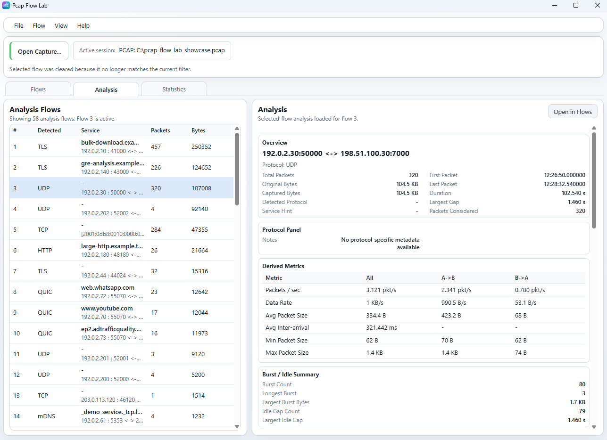
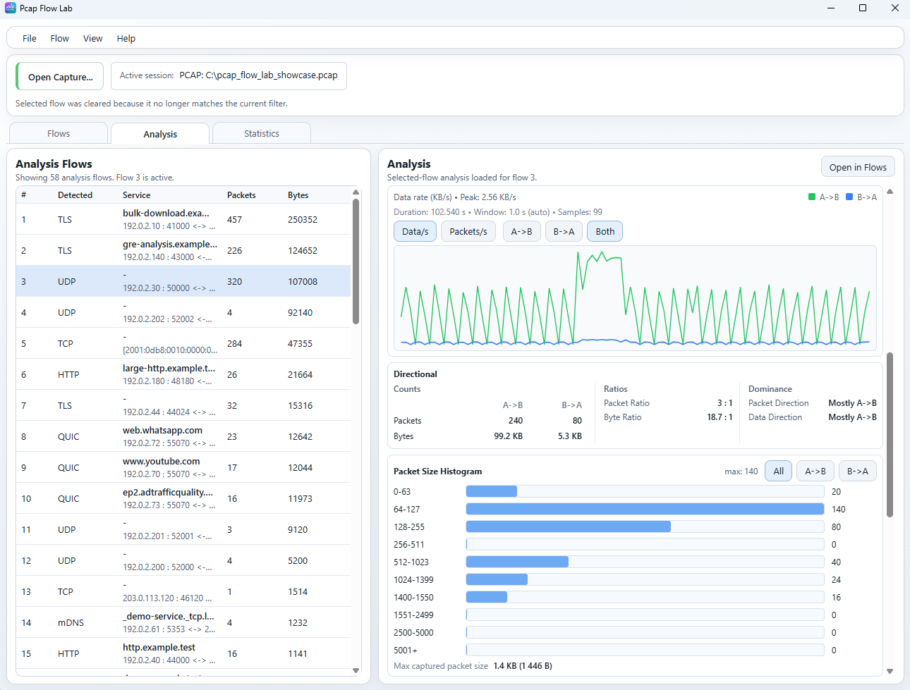
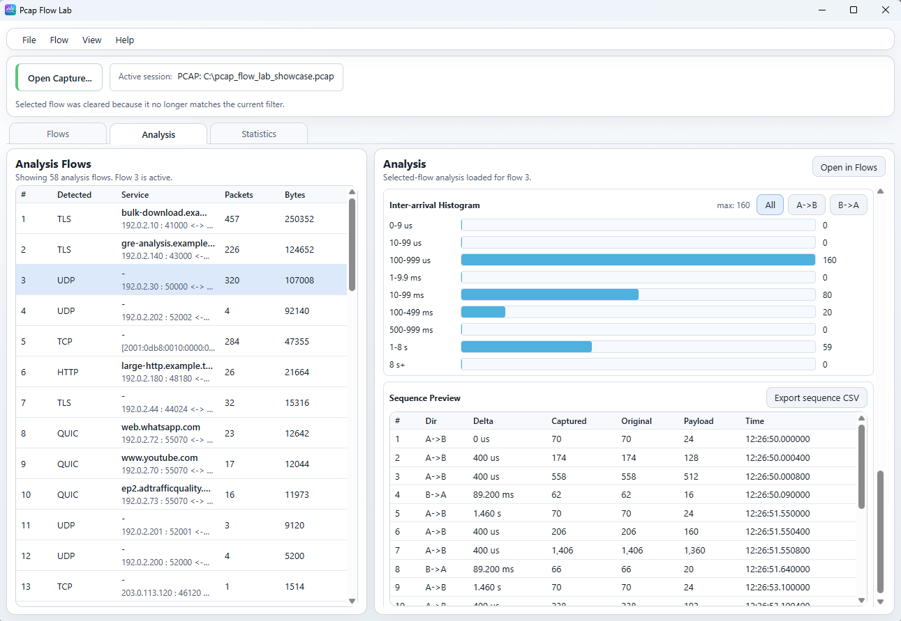

# Analysis workspace

Qt is the primary Pcap Flow Lab desktop UI. The screenshots on this page use
the Tauri UI because its compact layout shows the Analysis blocks clearly. The
underlying Analysis calculations documented here come from the shared backend
used by both desktop frontends.

For a whole-window overview, see [Main window](main-window.md). For packet and
stream inspection after you identify an interesting flow, see
[Flows workspace](flows.md).

## What Analysis is for

`Analysis` is a selected-flow quantitative workspace. It is not the whole-
capture `Statistics` workspace.

Use it when you want to:

- inspect one canonical flow as a whole;
- compare `A->B` and `B->A` traffic behavior;
- understand rates, timing, sizes, bursts, and idle gaps;
- preview packet order and export the flow sequence;
- jump back into `Flows` for packet-level or stream-level inspection.

## Select a flow to analyze

The left side of the workspace is `Analysis Flows`.

Each row represents one canonical flow and currently shows:

- `#`
- `Detected`
- `Service`
- `Packets`
- `Bytes`
- an endpoint summary line

Selecting a row makes that flow the active Analysis target on the right.

Field meanings:

- `#` is the same one-based canonical flow number used elsewhere in the UI.
- `Detected` keeps the same detected-protocol meaning as in `Flows`.
- `Service` keeps the same service-hint meaning as in `Flows`.
- `Packets` is the total number of packets in that flow.
- `Bytes` is the flow's original byte total, not a payload-only value.
- The endpoint summary uses the stored flow orientation and shows
  `Endpoint A <-> Endpoint B`.

This list is for flow selection. The documented user contract here is not
sorting or filtering behavior.

## Overview and protocol metadata

*Overview, protocol-specific metadata, derived metrics, and burst/idle summary
for the selected flow.*

### Overview

The `Overview` block summarizes the selected flow as a whole.

Current fields:

- `Total packets`
- `Original bytes`
- `Captured bytes`
- `Detected Protocol`
- `Service hint`
- `First packet`
- `Last packet`
- `Duration`
- `Largest gap`
- `Packets considered`

Semantics:

- `Total packets` is the flow packet count.
- `Original bytes` is the sum of original packet lengths across the flow.
- `Captured bytes` is the sum of captured packet lengths across the flow.
- `Detected Protocol` is the selected flow's detected protocol hint when one is
  available.
- `Service hint` is the current service metadata carried by the flow.
- `First packet` and `Last packet` are shown as complete UTC timestamps for
  the first and last packets in the selected flow.
- `Duration` is the difference between the last packet timestamp and the first
  packet timestamp, shown with millisecond precision. A valid one-packet or
  zero-duration flow is shown as `00:00:00.000`.
- `Largest gap` is the largest time gap between consecutive packets in the
  flow's time-ordered packet sequence.
- `Packets considered` is the packet count that the Analysis calculations
  actually used for the selected flow's timeline-driven metrics.

In current production Analysis, `Packets considered` normally matches `Total
packets`, because the service analyzes the complete time-ordered packet set for
the selected flow. The field is still useful because it makes the analysis
scope explicit for timing, histogram, and graph calculations.

### Protocol Panel

`Protocol Panel` exposes additional protocol-specific metadata when the current
selected flow has stable Analysis-level metadata to show.

Examples include:

- `TLS version` or `QUIC version`
- `SNI / service`
- TCP control counts such as `SYN packets`, `FIN packets`, and `RST packets`

When no protocol-specific metadata applies, the panel can show:

`No protocol-specific metadata available`

That does not mean Analysis is unavailable. It only means the selected flow
does not currently expose extra protocol-specific summary fields beyond the
general quantitative metrics.

## Derived metrics

### Rate and packet-size metrics

`Derived Metrics` compares `All`, `A->B`, and `B->A`.

Current rows:

- `Packets/sec`
- `Original data rate`
- `Avg packet size`
- `Avg inter-arrival`
- `Min packet size`
- `Max packet size`

Semantics:

- `Packets/sec` uses packet count divided by whole-flow duration. Directional
  columns use the same duration denominator with only that side's packet count
  in the numerator. If the flow duration is zero, the rate is shown as zero.
- `Original data rate` uses original bytes, not captured bytes and not payload
  bytes. It is original-byte volume divided by whole-flow duration. Directional
  columns use the same rule with each side's original-byte total.
- `Avg packet size` uses original packet length. Directional columns use each
  side's original-byte total divided by that side's packet count.
- `Avg inter-arrival` is the average time gap between consecutive packets in
  the flow's global time-ordered sequence. The current product computes only
  the overall value, so the directional columns intentionally show unavailable
  values rather than a directional average.
- `Min packet size` and `Max packet size` use original packet lengths, not
  captured lengths. Directional columns are unavailable when that side has no
  packets.

### Burst and idle summary

`Burst / Idle Summary` applies exact whole-flow timing rules to the global
time-ordered packet sequence.

Current fields:

- `Burst count`
- `Longest burst`
- `Largest burst bytes`
- `Idle gap count`
- `Largest idle gap`

Current semantics:

- A burst is a run of packets where consecutive packets are less than `1 ms`
  apart.
- A single isolated packet does not count as a burst by itself.
- `Burst count` is the number of qualifying burst runs.
- `Longest burst` is the largest packet count inside one qualifying burst run.
- `Largest burst bytes` uses original bytes and reports the largest original-
  byte sum of one qualifying burst run.
- An idle gap is a consecutive-packet gap of at least `100 ms`.
- `Idle gap count` is the number of such qualifying gaps.
- `Largest idle gap` is the biggest qualifying idle-gap duration.

These calculations are whole-flow metrics. They are not split into directional
sub-bursts or directional idle summaries.

## Rate and direction

*Rate graph, directional summary, and packet-size distribution for the selected
flow.*

### Rate graph

The rate graph shows the selected flow over time.

Current controls:

- `Original data/s`
- `Packets/s`
- `A->B`
- `B->A`
- `Both`

Current context labels:

- `Peak`
- `Duration`
- `Window`
- `Samples`

Semantics:

- `Original data/s` uses original packet lengths recorded by the capture when
  computing bytes per second within each graph window. It is not a physical
  line-rate metric.
- `Packets/s` uses packet count per second within each graph window.
- `A->B` and `B->A` show one directional series at a time.
- `Both` overlays both directional series together.
- `Window` is chosen automatically by the product. It is not a manual user
  control in the current UI.
- The automatic window is selected from whole-flow duration and then clamped so
  the graph stays useful and bounded. Current production Analysis uses an auto
  window between `10 ms` and `1 s`, widening as needed to keep the graph point
  count bounded.
- `Samples` is the number of displayed graph points for the current rendered
  series set.
- `Peak` is the highest currently displayed value for the selected metric and
  visible series, not a separate whole-flow maximum detached from the current
  graph mode.

Short flows can legitimately omit the graph and show a fallback message such as
`Flow too short for rate graph`.

### Directional counts and ratios

The `Directional` block uses the stored flow orientation from `Flows`.

That means:

- `A->B` and `B->A` are stable flow-orientation labels;
- they are not guaranteed client/server roles;
- they should not be read generically as upload/download or
  request/response.

The `Counts` section shows:

- packet totals by direction;
- original-byte totals by direction.

The `Ratios` section shows:

- `Packet ratio`
- `Byte ratio`

Current ratio display uses larger-to-smaller orientation for readability. It
is not always printed as literal `A->B : B->A`.

For example, if one side has four times the traffic of the other side, the
ratio text is shown as `4 : 1` regardless of which side is larger. Use the
separate directional counts to see which side actually owns the larger share.

### Direction dominance

The `Dominance` section summarizes directional skew separately for packets and
for bytes.

Current values are:

- `Balanced`
- `Mostly A->B`
- `Mostly B->A`

Current rule:

- if both sides are zero, the result is `Balanced`;
- if one side is zero and the other is not, the non-zero side is `Mostly ...`;
- otherwise the result stays `Balanced` while the larger side is at most twice
  the smaller side;
- once the larger side exceeds that `2x` threshold, dominance becomes
  `Mostly A->B` or `Mostly B->A`.

This is the same qualitative rule used across the current product family for
direction summaries.

## Packet-size distribution

The `Packet Size Histogram` has two local selectors:

- `Original`
- `Captured`
- `All`
- `A->B`
- `B->A`

`Original` uses the original packet length recorded by capture metadata.
`Captured` uses the bytes actually retained in the capture.

The size selector and the direction selector are independent. For example, you
can inspect `Captured` + `B->A` without reloading Analysis.

Current bucket boundaries are the same for both size modes:

1. `0-63`
2. `64-127`
3. `128-255`
4. `256-511`
5. `512-1023`
6. `1024-1399`
7. `1400-1550`
8. `1551-2499`
9. `2500-5000`
10. `5001+`

The separate line:

`Max captured packet size`

reports the maximum captured packet length seen in the selected flow. This
value is still useful even when the histogram is currently showing `Original`
bucket counts.

## Inter-arrival timing

*Inter-arrival distribution and the beginning of the selected flow's packet
sequence preview.*

### Inter-arrival histogram

The `Inter-arrival Histogram` is based on gaps between consecutive packets in
the selected flow's global time-ordered packet sequence.

One interval means:

- take one packet in the ordered flow sequence;
- compare it to the immediately previous packet in that same ordered sequence;
- bucket the time difference.

Current directional toggles:

- `All`
- `A->B`
- `B->A`

Directional semantics are important:

- `All` counts every consecutive-packet gap in the global ordered sequence.
- `A->B` and `B->A` do not build separate same-direction-only timelines.
- Instead, the current product classifies each global consecutive-packet gap by
  the direction of the later packet in that pair.

Current bucket boundaries:

1. `0-9 us`
2. `10-99 us`
3. `100-999 us`
4. `1-9.9 ms`
5. `10-99 ms`
6. `100-499 ms`
7. `500-999 ms`
8. `1-8 s`
9. `8 s+`

## Sequence Preview

`Sequence Preview` is a compact ordered packet preview for the selected flow.

Current columns:

- `#`
- `Dir`
- `Delta`
- `Captured`
- `Original`
- `Payload`
- `Time`

Semantics:

- `#` is the one-based packet number within the selected flow's ordered
  sequence.
- `Dir` is the packet direction using the stored `A->B` / `B->A` orientation.
- `Delta` is the time since the previous packet in the selected flow's global
  ordered packet sequence. The first preview row uses zero because there is no
  previous packet in the previewed flow sequence.
- `Captured` is the packet's captured length.
- `Original` is the packet's original length.
- `Payload` is the original transport-payload length when that value can be
  derived authoritatively from packet headers. When it cannot be derived, the
  UI shows an unavailable marker instead of inventing a value.
- `Time` is the packet timestamp in the current flow preview, formatted as
  `HH:MM:SS.UUUUUU`.

Current preview scope:

- the rows are ordered by packet time within the flow;
- the preview is bounded;
- the current UI shows the first `20` packets from that ordered sequence rather
  than an unbounded full-flow table.

### Export sequence CSV

`Export sequence CSV` exports the selected flow's sequence rows as CSV.

Current export scope is broader than the bounded on-screen preview:

- it exports the selected flow's full ordered packet sequence, not only the
  first visible preview rows.

Current CSV columns are:

- `flow_packet_index`
- `packet_index`
- `direction`
- `timestamp`
- `delta_us`
- `captured_length`
- `original_length`
- `transport_payload_length`
- `tcp_flags`
- `protocol_hint`

The exported direction, timestamps, and deltas use the same semantics as the
Sequence Preview. The CSV is meant as a sequence-analysis export, not merely a
screenshot-equivalent dump of the first visible rows.

## Interpreting unavailable values

Some Analysis fields legitimately render `-` or `—`.

Common reasons:

- the selected flow has no packet on one directional side;
- a directional average is not defined in the current product;
- the selected protocol has no protocol-specific metadata panel;
- a transport payload length cannot be derived safely from packet headers;
- the flow is too short for the current rate-graph surface.

For one-packet or zero-duration flows, this can especially affect:

- rate values;
- average inter-arrival;
- directional min/max values on an unused side;
- rate-graph availability.

These are normal presentation states, not necessarily errors.

## Open the flow in Flows

`Open in Flows` bridges back to the detailed inspection workspace.

It takes the same canonical flow that is currently active in `Analysis` and
opens it as the active target in `Flows`, where you can inspect:

- packet rows;
- packet summary and bytes;
- stream items;
- stream item summaries and item data.

This is the normal handoff when Analysis tells you which flow is interesting
and you then want packet-level or stream-level detail.

## Related documentation

- [Main window](main-window.md)
- [Flows workspace](flows.md)
