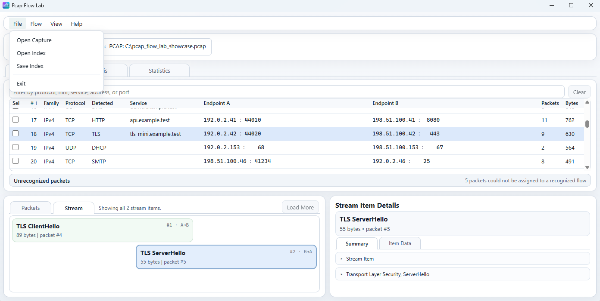
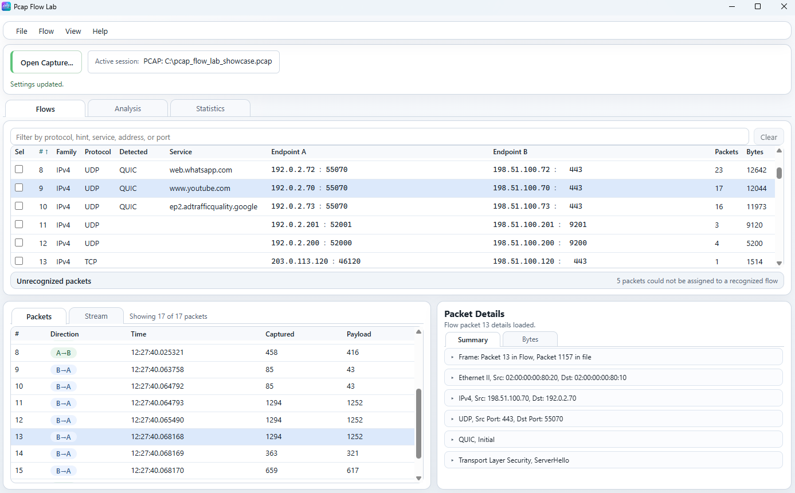
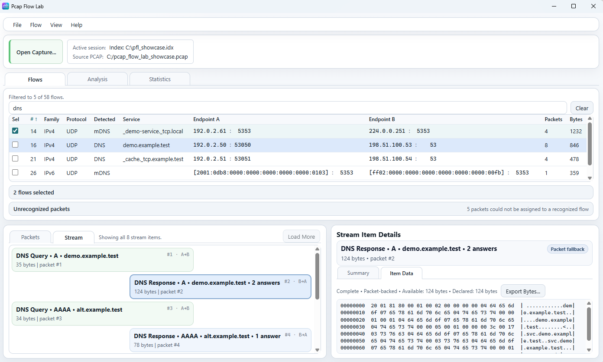
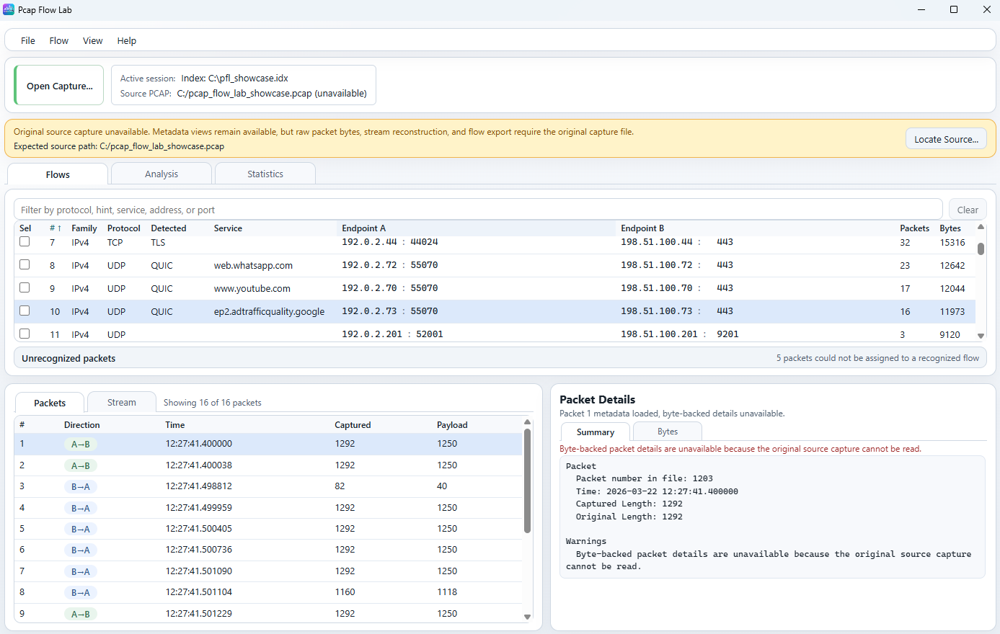
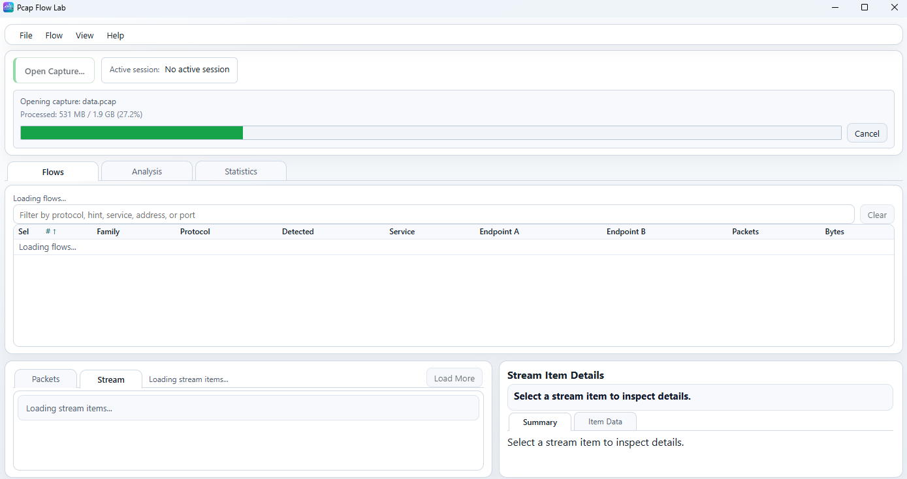

# Captures and indexes

Qt is the primary Pcap Flow Lab desktop UI. The screenshots on this page use
the Tauri UI because its compact layout shows session states, source-capture
states, and open-progress states more clearly. The capture/index behavior
documented here is shared with the Qt desktop workflow.

For a whole-window overview, see [Main window](main-window.md). For flow-level
inspection after a session is open, see [Flows workspace](flows.md),
[Analysis workspace](analysis.md), and [Statistics workspace](statistics.md).

## Open captures and indexes

Pcap Flow Lab currently opens three desktop input kinds:

- raw `PCAP` captures;
- raw `PCAPNG` captures;
- saved Pcap Flow Lab analysis indexes (`.idx`).

This page uses three terms consistently:

- `raw capture` means a directly opened `PCAP` or `PCAPNG` file;
- `index` means a previously saved Pcap Flow Lab analysis/index file;
- `source capture` or `Source PCAP` means the original packet file associated
  with an index.

### File menu

*The File menu actions used for session open/save work.*

The current file/session actions are:

- `Open Capture`
- `Open Index`
- `Save Index`
- `Exit`

`Open Capture` opens a raw `PCAP` or `PCAPNG` and builds the current canonical
flow inventory from that file.

`Open Index` opens a previously saved Pcap Flow Lab index and restores the
stored flow inventory and related indexed metadata.

`Save Index` saves the current session as an analysis index. It is available
only when the current session has an attached source capture. In practice this
means:

- a raw capture can be saved as an index after it opens successfully;
- an opened index can be saved again when its source capture is currently
  available;
- an index whose source capture is unavailable cannot be saved again until the
  original capture is reattached.

Current Qt save behavior:

- the save dialog title is `Save Analysis Index`;
- the file type is `Index Files (*.idx)`;
- the default suffix is `.idx`;
- overwrite confirmation is still handled normally by the save dialog.

`Exit` simply closes the application.

## Raw capture session

*A directly opened raw capture. The active session itself is the source of
packet bytes.*

After you directly open a raw `PCAP` or `PCAPNG`, that file becomes both:

- the current active session; and
- the source of original packet bytes for byte-backed inspection.

At that point the application has already applied the current capture-
processing grouping settings while importing the raw capture and building the
canonical flow inventory.

Use [capture processing settings](../reference/settings.md) for the detailed
grouping-setting reference. The important lifecycle rule here is simple:

- settings apply when a raw capture is opened/imported;
- the resulting canonical flow inventory can then be saved into an index;
- reopening that index later reuses the stored inventory rather than
  regrouping it from current GUI settings.

### Active session

The top `Active session` area is the primary visual indicator of what the
application is currently analyzing.

Current states:

- no session: `No active session`
- raw capture: `PCAP: <path>`
- opened index: `Index: <path>`

When an index is open, the same top area can also show:

- `Source PCAP: <path>` when the original source capture is currently
  available; or
- `Source PCAP: UNAVAILABLE` plus `Expected source path: <path>` when the
  index opened successfully but the original capture bytes are not currently
  reachable.

## Save and reuse an index

Saving an index is useful when you want to reopen an already materialized flow
inventory later without treating every reopen as a fresh raw-capture import.

At a user level, the current index keeps the information needed to reopen the
stored analysis session, including:

- the canonical flow inventory;
- packet metadata and references needed by indexed workflows;
- stored flow-grouping identity such as protocol-path-based inventory state;
- whole-session summary/statistics metadata;
- detected protocol/service metadata already persisted by the indexed session;
- the original source-capture reference/path used to find the packet file
  again later.

What an index does **not** replace is the original source packet bytes.

That distinction matters because some workflows are metadata-backed and some
are byte-backed:

- metadata-backed workflows can continue from the index alone;
- byte-backed workflows still need the original source capture.

## Index with source capture available

*An opened index with its original source capture available again.*

When an index opens and the original capture is available, the top session area
shows both:

- `Active session: Index: ...`
- `Source PCAP: ...`

This is the most complete index-backed state.

User-level meaning:

- the index provides the stored analysis inventory and metadata;
- the `Source PCAP` provides the original packet bytes;
- metadata-backed and byte-backed workflows are both available again.

In this state, current production behavior supports:

- normal flow inventory browsing;
- Analysis and Statistics;
- packet/stream workflows that need source bytes;
- packet `Bytes` inspection;
- stream reconstruction and stream-backed details;
- stream `Item Data`;
- source-backed export operations such as flow export.

## How the source capture is found

When an index is opened, the application keeps the expected/original source
capture path stored with that index and checks whether that capture is still
available and still matches the indexed source identity.

At a user level, the current behavior is:

- the index remembers the expected original capture path;
- opening the index automatically attempts to use that expected source;
- if the expected source is still present and matches the indexed source
  identity, it is attached automatically;
- if the file moved or no longer matches, the index can still open as a useful
  metadata-oriented session, but byte-backed features stay unavailable until
  the correct source is reattached.

The application does not accept an arbitrary replacement capture. A candidate
source must match the index's expected source identity.

## Index without source capture

*A valid index opened without its original source capture. Metadata remains
available, but byte-backed workflows are degraded until the source is
reattached.*

This state is intentionally different from a failed index open.

The index itself is still valid and usable, but the original source bytes are
currently unavailable. The UI surfaces that clearly with:

- `Source PCAP: UNAVAILABLE`
- `Expected source path: ...`
- a warning banner explaining that metadata views remain available, while raw
  packet bytes, stream reconstruction, and flow export require the original
  capture file
- `Locate Source Capture`

### What remains available

Without source bytes, the current product still keeps the index useful for
metadata-oriented work. Current verified behavior includes:

- the stored flow inventory still opens;
- flow filtering, sorting, and selection still work;
- Analysis remains available from indexed metadata;
- Statistics remains available from indexed metadata;
- whole-session totals and indexed protocol summaries remain available;
- packet-list metadata can still be listed from the index;
- metadata-oriented placeholders still explain why byte-backed detail surfaces
  are unavailable.

In other words, the session is degraded, but it is not empty and it is not a
failed open.

### What requires source bytes

Current source-byte-backed operations include:

- exact packet byte materialization and packet `Bytes` views;
- byte-backed packet protocol details;
- stream reconstruction;
- stream-backed `Stream Item Details`;
- `Item Data` materialization for stream items;
- flow export and other packet-byte export workflows.

If the original source capture is unavailable, those features stay unavailable
until the correct source file is attached again.

### Locate Source Capture

Use `Locate Source Capture` when the original capture moved or is no longer at
the stored path.

Current user-facing behavior:

1. choose a candidate capture file;
2. the application validates that file against the index's expected source;
3. if it matches, byte-backed features become available again;
4. if it does not match, the candidate is rejected.

Reattaching a source capture does **not** rebuild or regroup the index
inventory. It restores byte-backed access for the already stored indexed
session.

## Opening large captures

*Asynchronous capture opening with visible byte progress and cancellation.*

Opening a large raw capture is asynchronous. The application does not require a
blank frozen window while the new session is prepared.

Current progress semantics:

- the UI shows an `Opening capture: ...` progress state;
- progress reports bytes processed relative to the input file's total size;
- the progress bar and percent are based on processed bytes versus known total
  bytes;
- workspace areas can show loading placeholders while the new session is still
  being prepared.

### Cancel

`Cancel` requests cancellation of the current open operation.

Current verified cancellation behavior:

- the previous session is not replaced immediately when a new open starts;
- the currently visible session is replaced only after the new open succeeds;
- cancelling the in-progress open leaves the previous session intact;
- cancellation does not leave a partially active replacement session behind;
- after cancellation, the status becomes `Open cancelled.`

The same preservation rule applies to failed opens: if a new raw capture or
index fails to open, the previous session remains active.

## Errors and compatibility

Current user-facing distinctions worth knowing:

- unreadable or missing raw capture: the open fails and the previous session is
  preserved;
- unreadable or invalid index: the open fails rather than becoming a degraded
  index session;
- valid index with missing source capture: the index still opens, but only the
  byte-backed parts are unavailable until the original source is reattached;
- mismatched source capture during `Locate Source Capture`: the file is
  rejected because it does not match the expected source;
- incompatible or incomplete index file: reopen the original raw capture and
  save a fresh index.

Partial raw-capture opens are also possible in current production when the
capture is truncated late enough that some packets were still imported
successfully. In that case the session opens with a warning that the capture
opened partially and that results are incomplete.

## Raw capture vs index

| Capability | Raw capture | Index with source | Index without source |
| --- | --- | --- | --- |
| Flow inventory | Available | Available | Available |
| Analysis | Available | Available | Available |
| Statistics | Available | Available | Available |
| Packet-list metadata | Available | Available | Available |
| Packet `Bytes` | Available | Available | Unavailable |
| Byte-backed packet details | Available | Available | Unavailable |
| Stream reconstruction | Available | Available | Unavailable |
| Stream `Item Data` | Available when the selected item has authoritative item-owned bytes | Available when the selected item has authoritative item-owned bytes | Unavailable |
| Flow export | Available | Available | Unavailable |
| Apply grouping settings | On open/import | No | No |

## Related documentation

- [Main window](main-window.md)
- [Flows workspace](flows.md)
- [Analysis workspace](analysis.md)
- [Statistics workspace](statistics.md)
- [Capture processing settings](../reference/settings.md)
- [CLI overview](../cli/README.md)
