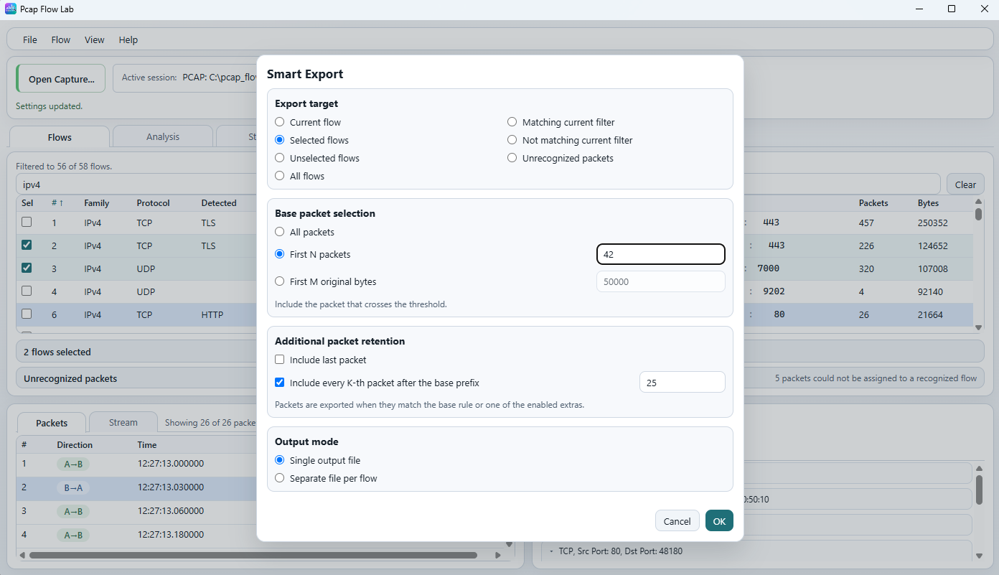
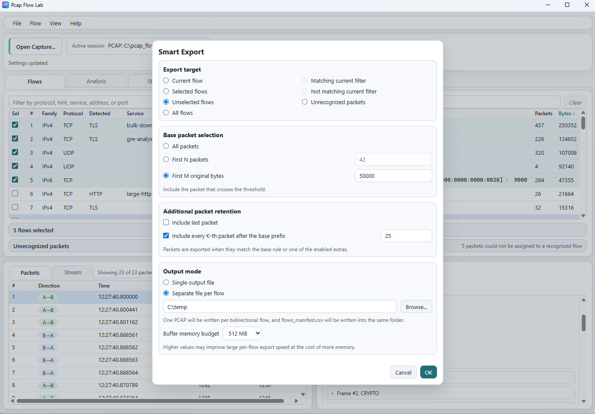
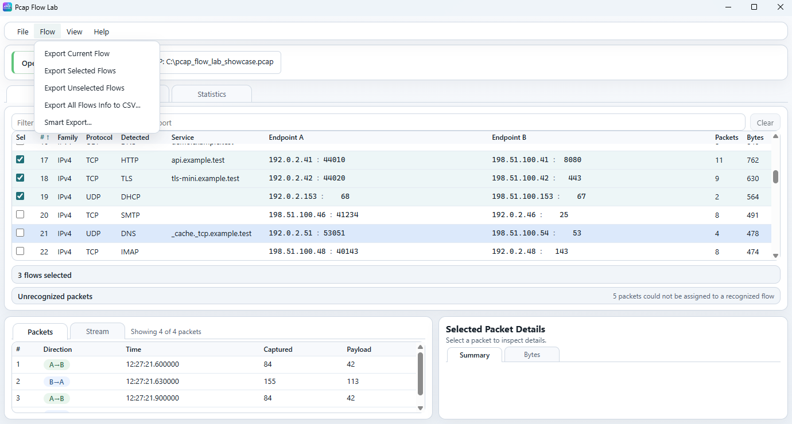

# Flow actions

The Qt application is the primary Pcap Flow Lab desktop UI. The screenshots on
this page use the Tauri UI because its compact layout makes the `Flow` export
workflows easier to show. The documented behavior is shared unless a
difference is called out explicitly.

For the main window layout, see [Main window](main-window.md). For detailed
flow-table behavior, see [Flows workspace](flows.md). For raw captures,
indexes, and source-capture reattachment, see
[Captures and indexes](capture-and-index.md). For the CLI export counterpart,
see [CLI `export-flows`](../cli/export-flows.md).

## What the `Flow` menu is for

The `Flow` menu contains the desktop export actions that operate on the current
flow inventory:

- `Export Current Flow`
- `Export Selected Flows`
- `Export Unselected Flows`
- `Export All Flows Info to CSV...`
- `Smart Export...`

These actions are easiest to understand if you keep two separate concepts in
mind:

- the active flow is the row you clicked for packet, stream, and analysis
  inspection;
- checked flows are the rows whose `Sel` checkboxes are enabled for multi-flow
  export operations.

The active flow and the checked-flow set are independent.

## Active flow vs checked flows

`Export Current Flow` uses the active flow only.

It does not care whether that flow is checked, and it does not export other
checked flows.

`Export Selected Flows` uses the checked-flow set only.

It does not require one of those checked flows to also be the current active
flow.

`Export Unselected Flows` exports every normal flow that is currently not
checked.

This is based on the full current canonical flow inventory, not just the
single active row.

## `Export Current Flow`

Use `Export Current Flow` when you want one complete canonical flow written to
one output PCAP.

Current behavior:

- it requires an active normal flow;
- it exports the full packet set for that one flow;
- output is a classic PCAP file;
- packets are written in capture order.

This action is byte-backed. If the current session does not have source packet
bytes available, the export stays unavailable until the original capture is
open or reattached.

This matters especially when you opened an index without currently accessible
source bytes. For the index/source-capture workflow, see
[Captures and indexes](capture-and-index.md).

## `Export Selected Flows`

Use `Export Selected Flows` when you want one combined PCAP containing all
checked normal flows.

Current behavior:

- only checked normal flows are exported;
- the output is one classic PCAP file;
- packets from all chosen flows are merged into capture order;
- duplicate packet references are suppressed if needed.

This is the quickest GUI workflow for “export these exact flows as one packet
set”.

## `Export Unselected Flows`

Use `Export Unselected Flows` when the checked set represents flows you want to
exclude instead of include.

Current behavior:

- every unchecked normal flow is exported;
- the output is one classic PCAP file;
- packets are merged into capture order across that remaining flow set.

This is useful when the checked rows represent exceptions, noise, or flows you
have already exported separately.

## `Export All Flows Info to CSV...`

This action exports flow metadata, not packet bytes.

Use it when you want a whole-session table of canonical flows for spreadsheet,
reporting, or downstream filtering work.

Current behavior:

- it exports all current canonical flows in the opened session;
- it does not depend on the active flow;
- it does not depend on checked flows;
- it writes one CSV file;
- it can work from raw captures or indexes because it exports flow metadata
  rather than packet bytes.

The CSV includes the core flow inventory fields such as:

- flow number;
- family, transport, protocol, and protocol hint;
- endpoints and ports;
- packet and byte totals;
- first/last timestamps and duration;
- protocol path text.

## `Smart Export...`

`Smart Export...` is the advanced GUI export workflow.

Use it when you want packet sampling rules, per-flow outputs, or alternative
selection modes that go beyond the three direct `Flow` menu PCAP exports.

### Smart Export target modes

The dialog can target:

- `Current flow`
- `Selected flows`
- `Unselected flows`
- `All flows`
- `Matching current filter`
- `Not matching current filter`
- `Unrecognized packets`

Important details:

- `Matching current filter` uses the currently active primary flow filter,
  which can be either `Simple Filter` or `Advanced Filter`.
- Only one primary filter mode is active at a time, so Smart Export does not
  combine Simple and Advanced filtering together.
- If `Statistics -> Protocol Path` has already narrowed the visible flow
  inventory, both `Matching current filter` and `Not matching current filter`
  stay inside that same restricted flow set.
- `Not matching current filter` uses the complementary hidden flow set inside
  the current flow inventory; it does not escape an active Protocol Path
  restriction.
- current-filter targets are available only when the active primary filter is
  meaningful: a non-empty Simple filter text or an Advanced filter with one or
  more active rules.
- `Unrecognized packets` is a separate packet export mode, not a normal-flow
  export mode.

### Packet retention rules

Smart Export works on whole packets. It never slices packets into partial byte
ranges.

Base retention modes:

- `All packets`
- `First N packets`
- `First M original bytes`

The `First M original bytes` mode includes the packet that reaches or crosses
the requested original-byte threshold, so the actual written total can exceed
`M`.

Optional extra retention rules:

- `Include last packet`
- `Include every K-th packet after the base prefix`

These extras are most useful when you want a bounded sample that still keeps
the flow tail or some sparse packets after the initial prefix.

### One file vs per-flow output

Smart Export supports two output styles:

- `Single output file`
- `Separate file per flow`

`Single output file` writes one combined classic PCAP for the chosen target
mode.

`Separate file per flow` writes one classic PCAP per selected bidirectional
flow and also writes `flows_manifest.csv` into the same folder.

The manifest is useful because it records both:

- the source-flow totals; and
- the exported totals actually written for each per-flow file.

### Buffer memory budget

The `Buffer memory budget` control appears only for `Separate file per flow`.

It is a performance/memory tradeoff for the export process:

- higher values can help large per-flow exports complete faster;
- higher values also use more memory;
- it does not change which packets qualify for export.

### Source-capture requirements

Smart Export is a byte-writing workflow, so it requires packet bytes from the
original source capture.

Practical implications:

- from a raw capture, Smart Export can use the currently opened packet bytes
  directly;
- from an index, Smart Export requires the source capture to still be
  available or reattached;
- if source bytes are unavailable, Smart Export cannot complete packet export.

## Export from a raw capture vs an index

The direct PCAP export actions and Smart Export write packet bytes, so their
availability depends on source bytes.

From a raw capture:

- full packet bytes are already available in the current session;
- packet-writing export actions can run directly.

From an index:

- canonical flow metadata can still be available;
- packet-writing export actions still need the original source capture bytes;
- if the source capture is missing, reopen or reattach it before exporting.

`Export All Flows Info to CSV...` is different because it exports session flow
metadata rather than packet bytes.

## Unrecognized-packet export

When the current session contains unrecognized packets, Smart Export can expose
an `Unrecognized packets` target mode.

Current behavior:

- this mode exports unrecognized packets as packets, not flows;
- it is available only when the session actually contains unrecognized
  packets;
- it still requires source packet bytes;
- it supports only a single output file;
- per-flow output is not used for unrecognized packets.

If you need the CLI equivalent, see [CLI `export-flows`](../cli/export-flows.md).
