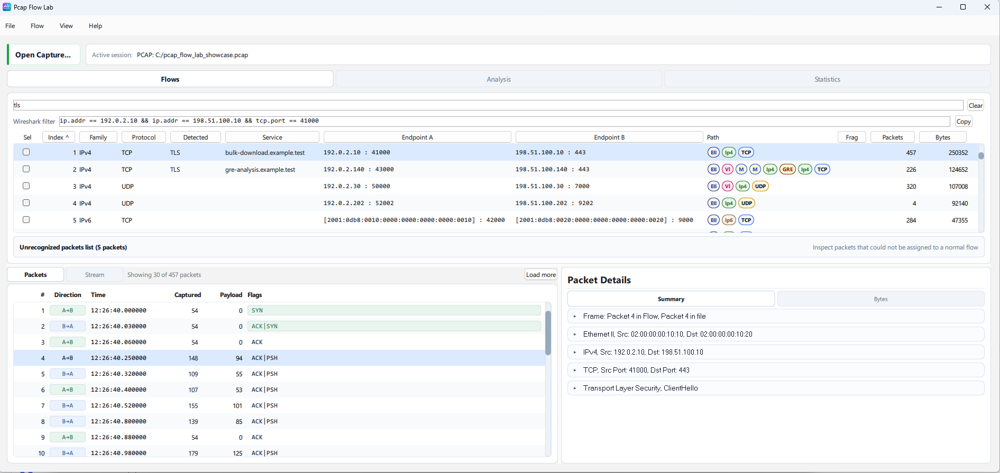
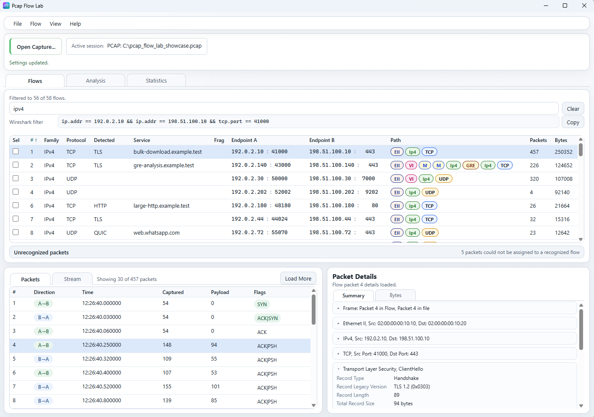
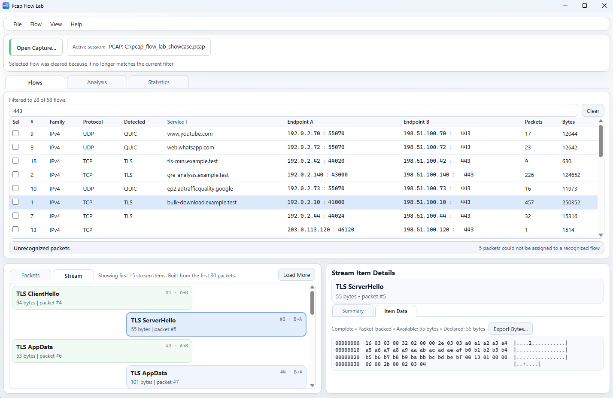
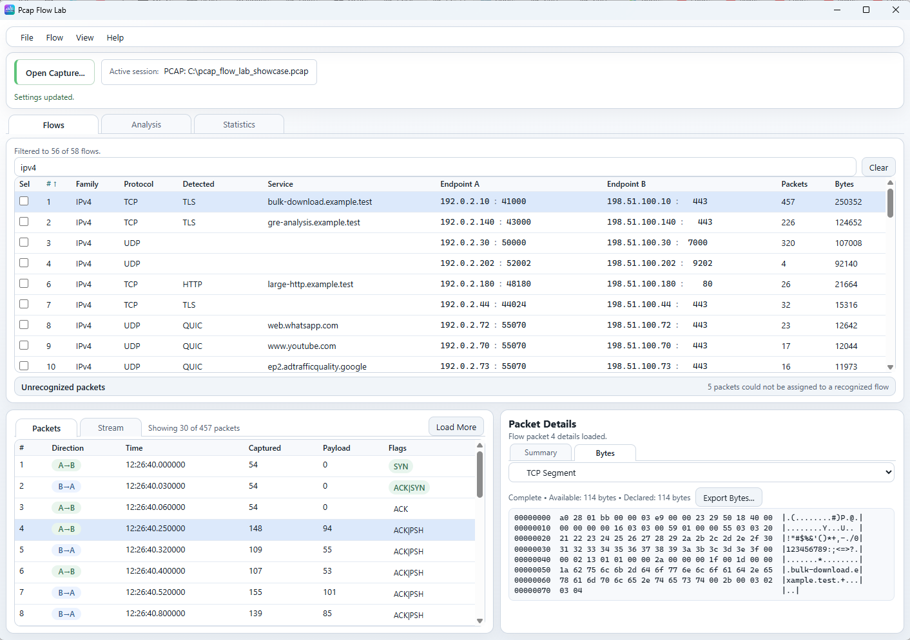
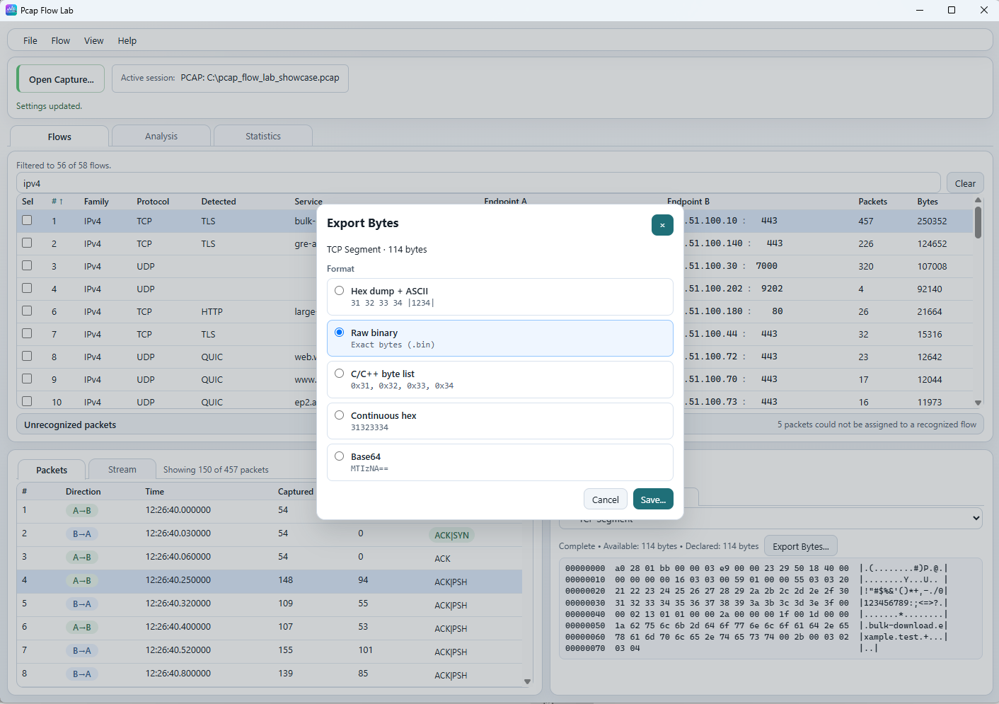
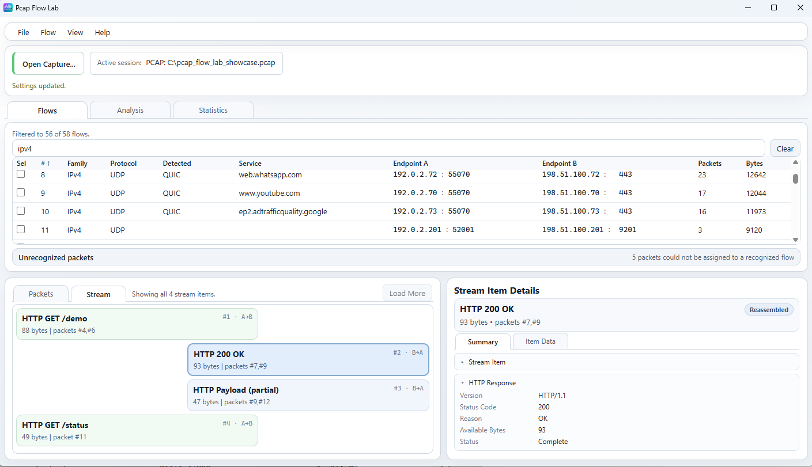
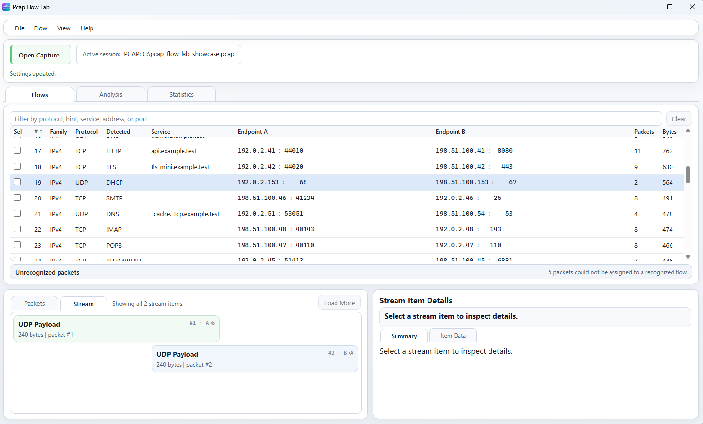
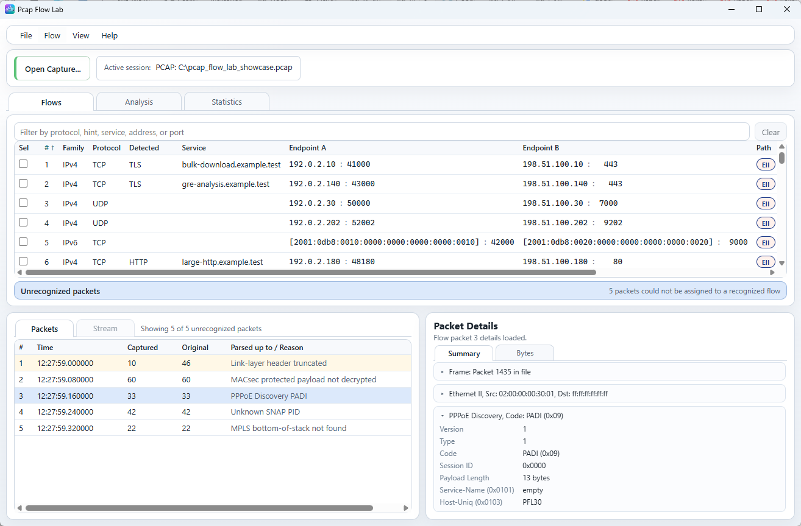

# Flows workspace

The Qt application is the primary Pcap Flow Lab desktop UI.
Some screenshots on this page use the Tauri UI because its compact layout
makes individual Flows workflows easier to show. The documented concepts are
shared unless a difference is called out explicitly.

For a whole-window overview, see [Main window](main-window.md). If you also use
the CLI, see [CLI overview](../cli/README.md). For capture-processing settings
that can affect flow identity and byte-backed inspection, see
[Capture processing settings](../reference/settings.md).

## Workspace overview

*Qt is the primary desktop UI. This screenshot establishes the same core Flows
concepts that the rest of this guide explains in more detail.*

This compact Tauri screenshot is useful for orienting the full Flows workflow:

1. The flow table and text filter define which canonical flows are visible.
2. The lower-left area shows either `Packets` or `Stream` for the active flow.
3. The lower-right inspector shows `Packet Details` or `Stream Item Details`.
4. `Load More` extends the currently loaded packet window for the active flow.
5. `Unrecognized packets` is a special row for packets that were imported but
   not assigned to a normal canonical flow.

The Flows workspace is designed around coordinated selection:

- choose a flow in the flow table;
- inspect packets or stream items for that flow;
- inspect the currently selected packet or stream item on the right.

For the dedicated guide to `Flow` menu exports, Smart Export targets, and
flow-info CSV export, see [Flow actions](flow-actions.md).

## Flow table

The flow table is the entry point for most inspection work.

Depending on current settings and view state, it can show:

- `Sel`
- `Index`
- `Family`
- `Protocol`
- `Detected`
- `Service`
- `Endpoint A`
- `Endpoint B`
- `Path`
- `Frag`
- `Packets`
- `Bytes`

Not every column is always visible. In particular:

- `Path` is optional;
- `Frag` is optional;
- the Wireshark filter row can be hidden.

### `Index`

`Index` is the one-based canonical flow number within the current flow
inventory.

This is the stable number you use inside the current opened capture or index
view. It is not a packet number, and it is not a guaranteed permanent ID across
captures created with different grouping settings.

### `Protocol`

`Protocol` is the canonical flow protocol category used for the flow itself.

In practice this is the transport or protocol family the application grouped as
the flow identity surface, such as TCP or UDP.

### `Detected`

`Detected` is the higher-level detected protocol classification when one is
available.

Examples can include values such as TLS, HTTP, QUIC, DNS, DHCP, and others.

This is classification metadata, not a promise that every downstream workflow
has a dedicated specialized parser for that protocol.

### `Service`

`Service` is protocol-derived service or descriptive metadata.

It is often a hostname or service hint, but it is not limited to hostnames.
Depending on protocol support and available metadata, it can also contain a
useful descriptive label derived from the traffic.

### `Endpoint A` and `Endpoint B`

`Endpoint A` and `Endpoint B` are the stored flow orientation.

They are useful for direction-aware reading across:

- packet direction;
- stream direction;
- analysis direction splits.

Do not read A/B as guaranteed client/server roles. They are the application’s
stored canonical orientation for the flow.

### `Path`

`Path` is the compact Protocol Path presentation for the flow.

At user level, it represents the canonical identity/presentation path used for
the flow, not necessarily the full literal layer stack of every packet that can
appear inside that flow.

This is why a selected packet’s `Packet Details -> Summary` can show a richer
or more specific captured packet stack than the compact flow `Path`.

### `Frag`

`Frag` appears when the fragmented-packet-count column is enabled.

It highlights whether the flow contains fragmented IP packets and, when
available, shows the current fragmented packet count for the flow.

### `Packets` and `Bytes`

`Packets` shows the total number of packets grouped into that flow.

`Bytes` shows the current flow byte total used by the main flow inventory. In
the current product this is the flow’s original byte total rather than a
display-only payload byte count.

## Active flow and checked flows

The flow table uses two different selection concepts.

### Active row

Clicking a flow row makes that flow the active inspection target.

The active flow controls:

- the `Packets` list;
- the `Stream` view;
- `Packet Details`;
- `Stream Item Details`;
- selected-flow `Analysis`.

### Checked flows

The `Sel` checkbox state is separate.

Checked flows are used for multi-flow actions such as export-oriented flow
operations. A checked flow does not automatically become the active inspection
target, and checking multiple flows does not switch the packet and stream panes
through those flows.

When one or more flows are checked, the Qt UI also shows a small selection
status line below the flow table.

## Filter and sort flows

Use the text filter above the flow table to narrow the visible flow set.

Current flow text filtering matches against:

- family;
- protocol;
- detected protocol;
- service metadata;
- endpoint addresses;
- endpoint strings;
- ports.

Use `Clear` to remove the current text filter quickly.

Column sorting is available directly from the flow-table headers. Current
sorting is available for the main visible inventory fields such as:

- `Index`
- `Family`
- `Protocol`
- `Detected`
- `Service`
- `Endpoint A`
- `Endpoint B`
- `Frag`
- `Packets`
- `Bytes`

Numeric columns such as `Packets`, `Bytes`, and `Frag` default naturally to a
descending-first view because that is usually the more useful operational
inspection order.

This screenshot shows a filtered flow list using `443` and a sorted table view.
The important behavior is that filtering is tied to the visible flow inventory:
if the previously active flow no longer matches the current filter, its active
selection can be cleared instead of leaving the lower inspection panes attached
to a hidden flow.

## Wireshark filter

When the GUI setting `Show Wireshark filter for selected flow` is enabled, the
Flows workspace can show a generated Wireshark display filter for the active
flow.

This row is flow-specific:

- it reflects the currently active flow;
- `Copy` copies the generated display filter text;
- the row can be hidden when that GUI setting is turned off.

This is a convenience feature for moving from Pcap Flow Lab flow selection to a
roughly corresponding Wireshark display filter. It is not a full Wireshark
tutorial.

## Inspect packets

The lower-left `Packets` tab is scoped to the currently active canonical flow.

The packet table is packet-oriented, not stream-oriented. Its job is to show
the captured packets currently loaded for the active flow.

The visible columns can include:

- packet number within the selected flow;
- `Direction`;
- `Time`;
- `Captured`;
- `Payload`;
- `Flags`.

### Packet list

Key semantics:

- the packet `#` is the one-based packet number within the currently selected
  flow;
- `Direction` is shown relative to `Endpoint A` and `Endpoint B`;
- `Captured` is the captured packet length shown in the packet list;
- `Payload` is the packet payload value surfaced for that list view;
- `Flags` is most meaningful for TCP rows and should not be interpreted as a
  universal per-protocol field.

Selecting a packet updates `Packet Details` immediately.

### Load more packets

Large flows are displayed through bounded packet windows rather than forcing the
entire flow into the UI at once.

At user level, this means:

- the footer text tells you how much of the selected flow is currently visible;
- `Load More` extends the visible packet range;
- extending the loaded packet range can also extend what the `Stream` tab is
  able to reconstruct.

The exact internal window size is intentionally not part of the user contract.

## Packet Details

`Packet Details` is the selected-packet inspector on the right side of the
Flows workspace.

Current tabs:

- `Summary`
- `Bytes`

There is no `Protocol` tab here.

### Summary

`Summary` is the structured selected-packet decoding surface.

Depending on the packet, it can show nested layers such as:

- `Frame`
- `Ethernet II`
- `IPv4` or `IPv6`
- `TCP` or `UDP`
- application layers such as `TLS`
- nested inner layers when encapsulation is present

The main point is that `Summary` shows the selected captured packet as a
decoded structure, not just a flat text dump.

Layers are expandable and collapsible, which makes it practical to inspect both
shallow packet headers and deeper protocol detail without leaving the Flows
workspace.

### Bytes

`Packet Details -> Bytes` is the byte-view surface for the selected packet.

This screenshot shows a selected `TCP Segment` byte view.

Current behavior:

- one packet can expose multiple byte views;
- the selector chooses the current protocol or unit view;
- the status line reports availability, completeness, and byte count;
- the data area shows a hex + ASCII representation;
- `Export Bytes...` exports the currently selected byte view.

Not every packet has every possible byte view. The available selector entries
depend on what the application can safely decode and materialize from the
selected packet.

### Export bytes

`Export Bytes...` exports the currently selected byte view, not automatically
the whole captured frame.

The currently available export formats are:

- `Hex dump + ASCII`
- `Raw binary`
- `C/C++ byte list`
- `Continuous hex`
- `Base64`

`Raw binary` writes the exact selected bytes for the current byte view.

This makes `Bytes` useful both for human inspection and for taking a specific
decoded packet unit out of the UI for external analysis.

## Inspect a Stream

`Stream` is different from `Packets`.

`Packets` shows captured packet records.

`Stream` shows directional semantic items derived from packets for the active
flow.

Depending on protocol support and available source bytes, those semantic items
can represent:

- protocol-aware request/response units;
- reconstructed higher-level payload ranges;
- generic directional payload items when no deeper specialized Stream parser is
  available.

Stream availability is constrained by:

- protocol support;
- readable source bytes;
- the currently loaded packet window.

### HTTP reassembly example

This is the main positive Stream example.

Visible ideas in this screenshot:

- an `HTTP GET` item;
- an `HTTP 200 OK` item;
- an `HTTP Payload` item that can be partial;
- packet provenance showing that one item can refer to multiple packets;
- directional layout across A->B and B->A;
- `Stream Item Details` with semantic HTTP summary data.

The important user-facing lesson is that one Stream item can be reconstructed
from bytes contributed by multiple captured TCP packets. You do not have to
manually assemble that packet sequence yourself inside the Flows workspace.

### Stream Item Details

`Stream Item Details` has two tabs:

- `Summary`
- `Item Data`

`Summary` shows protocol-aware semantic fields for the selected stream item.

`Item Data` is the byte/text materialization surface for the selected item.

Important current rule:

- `Item Data` is available only when there is one authoritative item-owned byte
  sequence to show.

This means a stream item can still be useful in `Summary` even when `Item Data`
is unavailable. When `Item Data` is available, `Export Bytes...` exports that
selected item-owned data view.

### Generic Stream fallback

`Detected` does not always guarantee a specialized Stream parser.

In this screenshot, the flow is detected as a higher-level protocol, but the
Stream surface still uses a generic directional payload-style representation.

The user-facing lesson is:

- `Detected` is valuable classification metadata;
- specialized Stream semantics depend on dedicated protocol-aware Stream
  support;
- when that deeper Stream support is not present, the application can still
  fall back to a generic payload-oriented Stream view.

This is still useful because it preserves direction, packet provenance, and the
selected-item inspection workflow.

## Unrecognized packets

`Unrecognized packets` is a special list, not a canonical flow.

When it is selected:

- `Packets` shows imported packets that were not assigned to recognized flows;
- `Stream` is unavailable as a normal inspection surface;
- the packet table shows fields that are useful for unrecognized imported
  packets;
- `Parsed up to` and `Reason` explain where decoding/import stopped safely;
- selecting a packet can still open `Packet Details` for any structured layers
  that were decoded safely before the failure or stopping point.

The screenshot uses a PPPoE Discovery PADI example, but the exact reason text
can vary. Other reasons can include truncated link-layer headers, protected
payloads that were not decrypted, unknown SNAP identifiers, or incomplete MPLS
stacks.

Treat those reason texts as examples, not as a complete catalog.

## Source-byte availability

Some Flows features require readable source packet bytes.

This matters especially for:

- packet byte views;
- `Stream` reconstruction;
- `Item Data`;
- selected-packet checksum validation.

When you work from an index without currently accessible source capture bytes,
flow-level metadata can still remain available while byte-backed inspection
surfaces become constrained.

In practice, this means:

- flow inventory can still be usable;
- packet and stream summaries can remain partially useful;
- byte materialization and deeper reconstruction can be reduced or unavailable
  until the source capture is accessible again.

## Qt and Tauri

Qt remains the primary desktop UI.

The Tauri screenshots on this page are used because they present the same Flows
workflow in a compact layout that is easier to illustrate in documentation.

Current user-relevant differences are limited:

- Qt remains the authoritative product UI;
- Tauri follows the same core Flows concepts and data semantics shown here;
- some helper text, spacing, persistence notes, or menu placement can differ.

If a screenshot and a future UI revision disagree in small layout details,
prefer the documented concept and the current Qt behavior unless a difference
is stated explicitly.

## Related documentation

- [Main window](main-window.md)
- [CLI overview](../cli/README.md)
- [Capture processing settings](../reference/settings.md)
