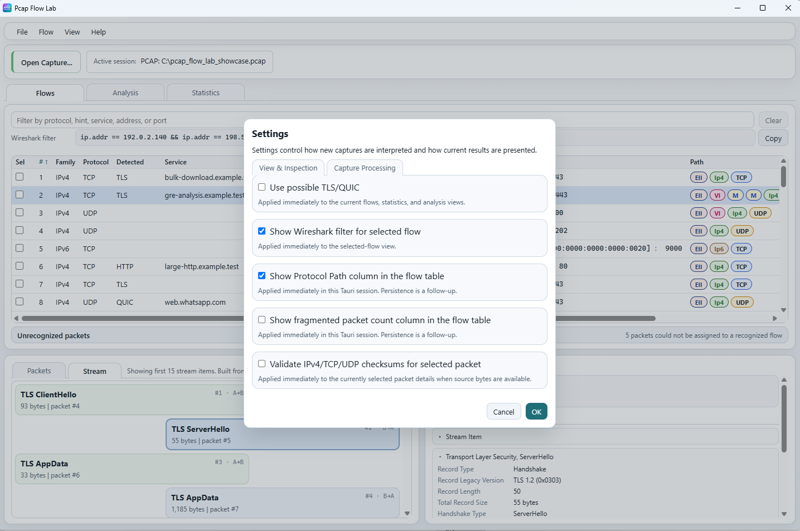
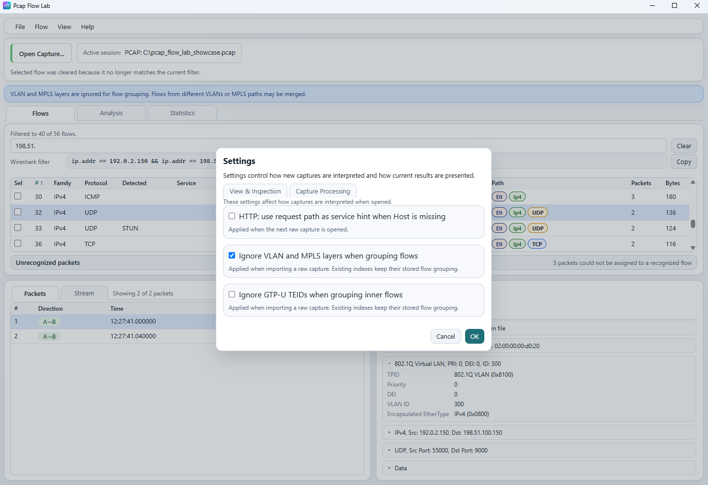
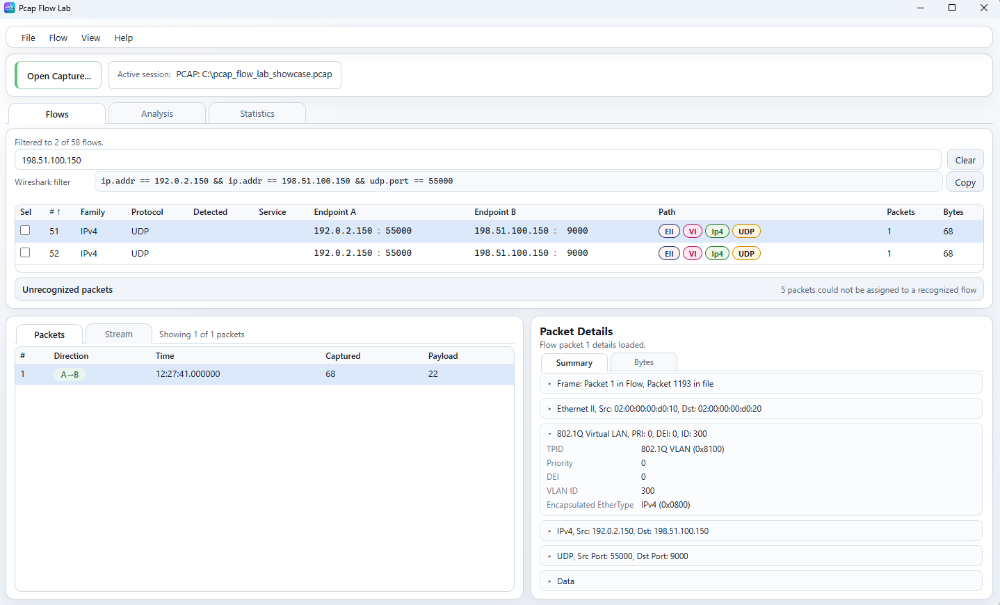
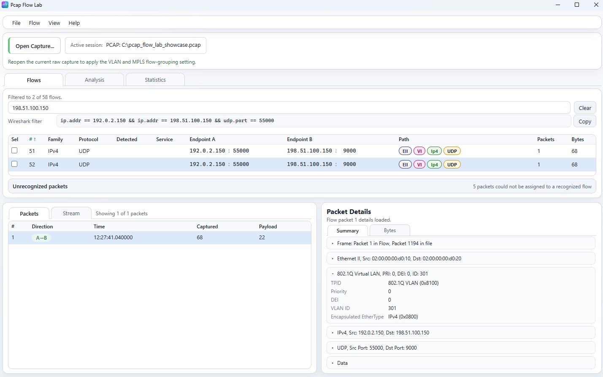
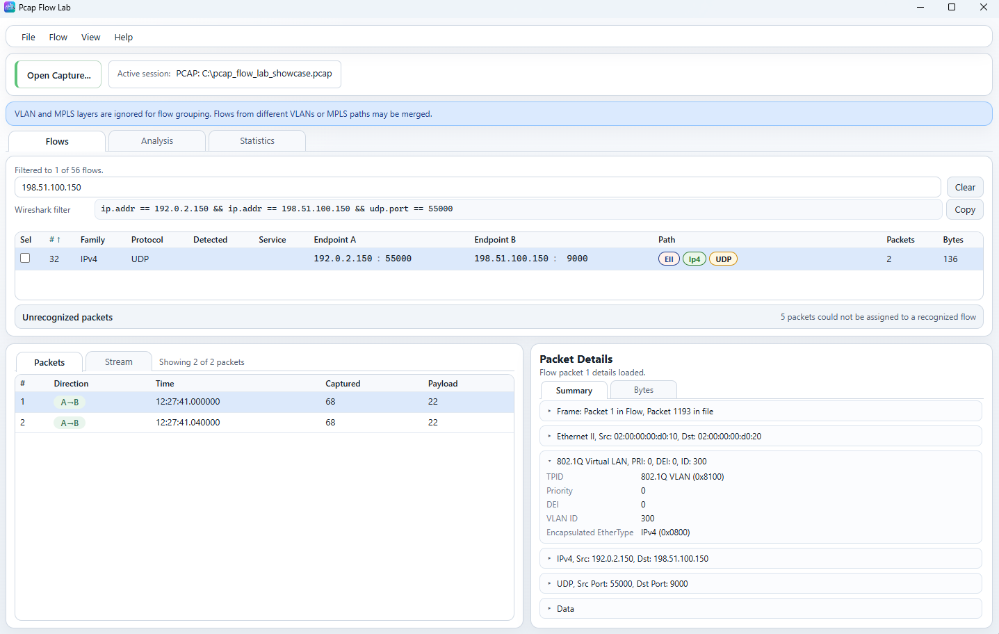

# Settings

Qt remains the primary desktop UI.

The screenshots on this page are from Tauri because the compact dialog makes
the before/after examples easier to show, but the core Settings workflow and
semantics described here are the current shared user-facing behavior.

## How Settings are applied

Open `View -> Settings` to edit pending Settings values.

Both frontends use normal staged dialog behavior:

- `OK` applies the pending changes.
- `Cancel` closes the dialog without applying pending changes.

The important practical distinction is not `Qt` vs `Tauri`, but what kind of
setting you changed:

- `View & Inspection` settings mostly change how the current desktop session is
  presented right away.
- `Capture Processing` settings affect how a raw capture is interpreted the
  next time that raw capture is opened or reopened.

Changing a flow-grouping option does not silently rebuild the current raw
capture. If the current flow inventory was already imported, it stays as-is
until you reopen that raw capture.

## View & Inspection

These settings are about presentation or selected-item inspection inside the
current desktop session.

### Use possible TLS/QUIC

`Use possible TLS/QUIC` applies immediately to the current flows, statistics,
and analysis views.

This option can surface likely TLS or QUIC interpretation in places where the
application has enough evidence to treat the traffic as a plausible match for
those protocols. It is not a promise of confirmed protocol identification in
every case.

### Show Wireshark filter

`Show Wireshark filter for selected flow` is presentation-only and applies
immediately to the selected-flow view.

When it is enabled, the Flows workspace shows the generated Wireshark display
filter row for the currently selected flow, and `Copy` copies that generated
filter text.

This changes only the UI row. It does not change flow identity, import
behavior, or packet analysis.

### Show Protocol Path column

`Show Protocol Path column in the flow table` is presentation-only. It shows or
hides the `Path` column in the flow table and applies immediately.

This changes only whether the normalized protocol path is visible in the table.
It does not change how flows were grouped.

Current user-visible persistence note:

- Qt presents this as an immediate UI option.
- Tauri currently notes that persistence for this column is still a follow-up.

### Show fragmented packet count column

`Show fragmented packet count column in the flow table` is also
presentation-only. It shows or hides the optional fragmented-packet count
column and applies immediately.

It does not change packet parsing, fragmentation detection, or flow grouping.

Current user-visible persistence note:

- Qt presents this as an immediate UI option.
- Tauri currently notes that persistence for this column is still a follow-up.

### Validate selected-packet checksums

`Validate IPv4/TCP/UDP checksums for selected packet` applies immediately to
selected `Packet Details` inspection when source bytes are available.

This affects selected-packet inspection only:

- it validates the IPv4 header checksum when applicable;
- it validates supported TCP and UDP checksums when the required bytes are
  available;
- it does not change capture import, flow grouping, or stream reconstruction.

## Capture Processing

These settings affect how a raw capture is interpreted when it is imported into
the desktop session. They are not just alternate views of the current flow
inventory.

### HTTP path as service hint

`HTTP: use request path as service hint when Host is missing` is used when HTTP
traffic does not provide a usable `Host` value.

In that case, the request path can be used as a service hint instead.

Lifecycle:

- it applies when the next raw capture is opened;
- it does not retroactively rebuild service hints inside an already imported
  session;
- opening an existing index does not re-import that stored inventory with this
  setting.

### VLAN and MPLS flow grouping

`Ignore VLAN and MPLS layers when grouping flows` changes canonical flow
identity during raw-capture import.

Normally, VLAN and MPLS layers participate in the canonical grouping identity.
When this option is enabled, those identity layers are normalized out for flow
grouping. As a result, otherwise-identical traffic carried across different
VLANs or MPLS paths can merge into one canonical flow.

That can change:

- canonical flow count;
- canonical flow numbering;
- the normalized `Path` shown for the resulting flow.

It does **not** remove the actual packet-level protocol layers from individual
packets. Packet bytes and packet summaries can still show the real VLAN or MPLS
structure carried by that packet.

When a raw capture is reopened with this normalization active, the UI can show
the current-session banner:

`VLAN and MPLS layers are ignored for flow grouping. Flows from different VLANs or MPLS paths may be merged.`

Treat that banner as a description of the grouping state that was actually used
to build the current raw-capture session, not as a simple mirror of the current
checkbox.

### GTP-U TEID grouping

`Ignore GTP-U TEIDs when grouping inner flows` works at the same conceptual
level for inner-flow identity.

When enabled:

- GTP-U remains part of packet inspection;
- packet-level TEID information remains available in packet details;
- TEID is ignored for canonical inner-flow grouping;
- otherwise-identical inner flows from different TEIDs can merge into one
  canonical grouped flow.

Lifecycle:

- it applies on raw capture import or reopen;
- it does not regroup the current already-imported raw session;
- opening an index keeps that index's stored grouping.

## Example: ignoring VLAN during flow grouping

This first screenshot shows the initial imported state before VLAN/MPLS
normalization has been applied to the raw capture.

In the example:

- there are two canonical flows;
- they share the same effective IPv4/UDP tuple;
- the flow `Path` still includes VLAN;
- each canonical flow contains one packet.

Here, different VLAN identity keeps those packets in separate canonical flows.

### Change the setting

In the second screenshot, the setting has already been changed and accepted,
but the current raw capture has not been reopened yet.

That is why the UI reports:

`Reopen the current raw capture to apply the VLAN and MPLS flow-grouping setting.`

At this stage, the current session is intentionally unchanged:

- the flow inventory still contains two flows;
- VLAN is still present in the current flow `Path`;
- `OK` changed the pending application setting, but did not silently rebuild
  the already imported capture.

### Reopen the raw capture

After reopening the same raw capture with VLAN/MPLS ignore enabled, the two
packets now belong to one canonical flow and the normalized flow `Path` no
longer includes VLAN.

The key distinction is:

- canonical flow identity can be normalized for grouping;
- actual packet protocol structure is still preserved.

So even after regrouping, `Packet Details` for an individual packet can still
show the real `802.1Q Virtual LAN` layer and that packet's actual VLAN ID.

Normalized canonical flow identity is therefore not the same thing as removing
protocol layers from packet inspection.

## Current session and next import

| Setting category | Current session | Next raw capture open |
| --- | --- | --- |
| View/presentation | Usually immediate | Continues according to the current frontend's UI behavior |
| Selected-packet inspection | Immediate when source bytes are available | Also applies |
| HTTP service hint processing | Current imported session is unchanged | Applied |
| VLAN/MPLS grouping | Current flow inventory is unchanged | Applied |
| GTP-U TEID grouping | Current flow inventory is unchanged | Applied |

## Settings and indexes

Raw captures and indexes follow different lifecycle rules.

For a raw capture:

- grouping settings are consumed when the raw capture is imported/opened;
- reopening that same raw capture can rebuild the canonical flow inventory
  under different grouping rules.

For an index:

- the flow inventory and grouping decisions are already stored;
- opening the index reuses that stored grouping;
- changing VLAN/MPLS or GTP-U grouping settings does not regroup the opened
  index.

Use [Captures and indexes](capture-and-index.md) for the broader raw-capture
and index lifecycle.

## GUI Settings and settings.json

GUI Settings contains more options than CLI `settings.json`.

The CLI `--settings settings.json` contract currently accepts exactly these
fields:

- `ignore_vlan_and_mpls_layers_when_grouping_flows`
- `ignore_gtpu_teids_when_grouping_inner_flows`
- `validate_selected_packet_checksums`

That means GUI-oriented presentation controls such as:

- `Show Wireshark filter for selected flow`
- `Show Protocol Path column in the flow table`
- `Show fragmented packet count column in the flow table`

are not `settings.json` properties.

Likewise, `HTTP: use request path as service hint when Host is missing` and
`Use possible TLS/QUIC` are GUI settings, but they are not part of the current
public CLI `settings.json` contract.

Use [Capture processing settings reference](../reference/settings.md) for the
canonical CLI field reference.

## Related documentation

- [Main window](main-window.md)
- [Flows workspace](flows.md)
- [Captures and indexes](capture-and-index.md)
- [Capture processing settings reference](../reference/settings.md)
