# Statistics workspace

Qt is the primary Pcap Flow Lab desktop UI. The screenshots on this page use
the Tauri UI because its compact layout shows the independent Statistics
sections clearly. The Statistics values documented here come from shared
backend computations rather than screenshot-only interpretation.

For a whole-window overview, see [Main window](main-window.md). For selected-
flow quantitative work, see [Analysis workspace](analysis.md). For detailed
packet, stream, and unrecognized-packet inspection, see
[Flows workspace](flows.md).

## What Statistics is for

`Statistics` is the whole-capture or whole-index quantitative workspace.

This is the key distinction from `Analysis`:

- `Analysis` explains one selected Flow.
- `Statistics` summarizes the active capture or index as a whole.

You do not need to select a flow first.

The top summary blocks and capture-time values are always visible. The heavier
detailed sections are collapsible and are loaded when you expand them. That
keeps the workspace fast to open while still exposing deeper capture-wide
summaries when you need them.

Expanding or collapsing a Statistics section changes only the presentation of
the live workspace. It does not define what exists in the session and does not
limit what is written by a full Statistics report export.

Current live Statistics workspace content includes:

- capture totals: `Packets`, `Flows`, `Original Bytes`, `Captured Bytes`;
- capture time: `Capture Start`, `Capture End`, `Duration`;
- `Transport Summary`;
- `IP Family Summary`;
- optional `Unrecognized Packets` totals when present;
- `Packet Size Distribution`;
- `Flows by Packet Count`;
- `Flows by Duration`;
- `Flows by Data Size`;
- `IP Fragmentation`;
- `Protocol Path Tree`;
- `Detected Protocol Hints`;
- `Capture Metrics`;
- `Flow Characteristics`;
- `Direction Distribution`;
- `TCP Flags`;
- `QUIC and TLS`;
- `Top Flows by Original Bytes`;
- `Top Endpoints and Ports`.

## Capture overview

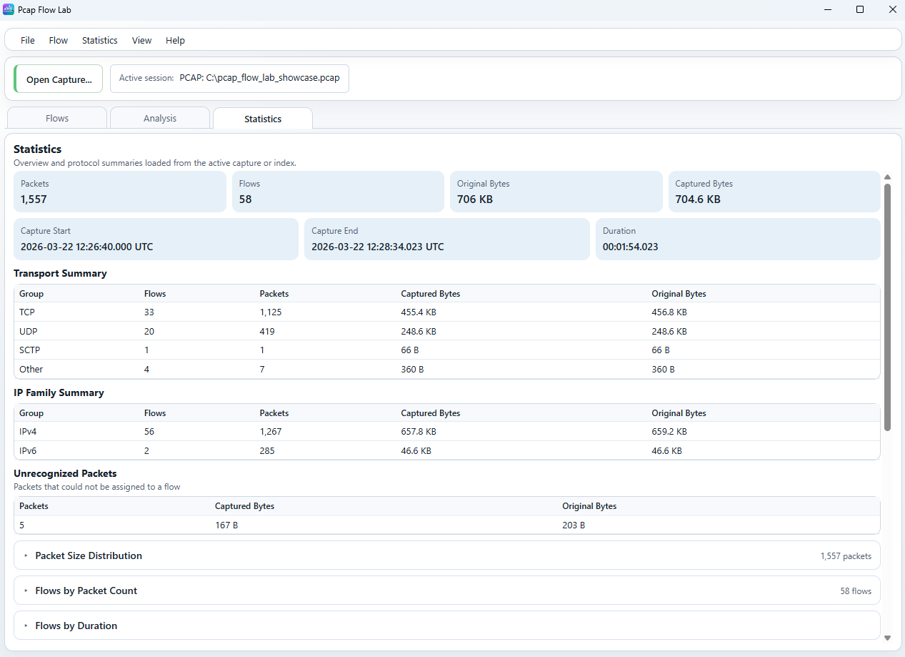

*Whole-capture totals, capture-time values, transport/family summaries, and
unrecognized-packet totals, with deeper capture-wide metrics in collapsible
sections below.*

At the top of `Statistics`, the application shows capture-wide totals:

- `Packets`
- `Flows`
- `Original Bytes`
- `Captured Bytes`

Current semantics:

- `Packets` is the total number of imported packets surfaced from the active
  capture or index, including unrecognized packets.
- `Flows` counts recognized Flows.
- `Captured Bytes` is the sum of captured packet lengths across the whole
  surfaced capture.
- `Original Bytes` is the sum of original packet lengths across the whole
  surfaced capture.

The whole-capture packet and byte totals can therefore be larger than the
recognized-Flow-only summary if some imported packets could not be assigned to
Flows.

When the active capture was opened only partially, `Statistics` shows a
warning that the values cover successfully imported packets only. The page must
not silently imply that a partial import represents the complete nominal
source file.

The always-visible capture-time row shows:

- `Capture Start`
- `Capture End`
- `Duration`

Current semantics:

- `Capture Start` is the earliest timestamp among successfully surfaced
  imported packets;
- `Capture End` is the latest timestamp among successfully surfaced imported
  packets;
- recognized and unrecognized packets both participate;
- `Duration` is the non-negative difference between end and start;
- a one-packet capture can therefore show identical start and end with a zero
  duration;
- an unavailable time range remains visually distinct from a real zero
  duration.

The UI presents absolute timestamps in UTC and does not silently switch to the
local machine timezone. Current visible formatting uses millisecond precision,
for example:

- `2026-03-22 12:26:40.000 UTC`
- `2026-03-22 12:28:34.023 UTC`
- `00:01:54.023`

### Transport Summary

`Transport Summary` groups recognized Flows by their stored
transport/protocol identity:

- `TCP`
- `UDP`
- `SCTP`
- `Other`

Current columns:

- `Flows`
- `Packets`
- `Captured Bytes`
- `Original Bytes`

Current semantics:

- rows are built from recognized Flows only;
- unrecognized packets are not added into these rows;
- Flow membership follows the Flow protocol stored for that Flow, not merely an
  outer encapsulation layer visible in one packet;
- `Other` contains recognized Flows whose stored protocol is neither
  TCP, UDP, nor SCTP.

### IP Family Summary

`IP Family Summary` currently reports:

- `IPv4`
- `IPv6`

with the same columns:

- `Flows`
- `Packets`
- `Captured Bytes`
- `Original Bytes`

Current semantics:

- these rows summarize recognized Flows by stored Flow family;
- unrecognized packets are excluded;
- the current user-facing table reports IPv4 and IPv6 only, rather than adding
  a separate non-IP family row.

### Unrecognized Packets

The `Unrecognized Packets` block summarizes imported packets that could not be
assigned to Flows.

Current fields:

- `Packets`
- `Captured Bytes`
- `Original Bytes`

This block is shown only when the active capture or index actually contains
such packets.

Use it as a whole-capture signal that part of the import remained outside the
normal flow inventory. When you want to inspect those packets directly, switch
to [Flows workspace](flows.md), where the `Unrecognized packets` row provides
the packet-level workflow.

## Packet Size Distribution

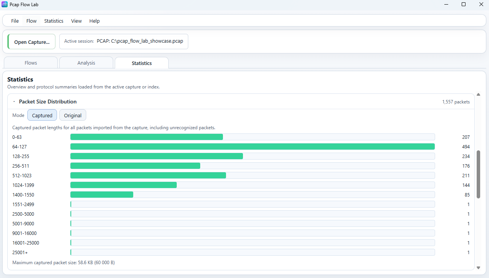

*Captured/original packet-length distribution for the active capture or index.*

Current production contract:

- it counts all surfaced imported packets;
- recognized and unrecognized packets both contribute;
- the buckets are shared across both modes;
- `Captured` uses the packet lengths actually present in the capture;
- `Original` uses the original packet lengths recorded by capture metadata.

Current bucket boundaries:

1. `0-63`
2. `64-127`
3. `128-255`
4. `256-511`
5. `512-1023`
6. `1024-1399`
7. `1400-1550`
8. `1551-2499`
9. `2500-5000`
10. `5001-9000`
11. `9001-16000`
12. `16001-25000`
13. `25001+`

The mode buttons are:

- `Captured`
- `Original`

The separate maximum line follows the selected mode:

- `Maximum captured packet size`
- `Maximum original packet size`

This intentionally differs from the selected-flow Analysis packet-size
histogram. In current production:

- `Statistics -> Packet Size Distribution` can show captured or original packet
  length across the whole capture;
- `Analysis -> Packet Size Histogram` uses original packet length.

That difference matters whenever truncation or snaplen causes captured length
and original length to differ.

## Flows by Packet Count

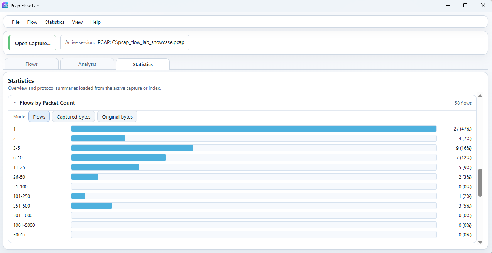

*Packet-count buckets with Flow count, captured-byte, and original-byte display
modes.*

`Flows by Packet Count` groups recognized Flows into packet-count
buckets.

Current bucket boundaries:

1. `1`
2. `2`
3. `3-5`
4. `6-10`
5. `11-25`
6. `26-50`
7. `51-100`
8. `101-250`
9. `251-500`
10. `501-1000`
11. `1001-5000`
12. `5001+`

Bucket membership is based on flow packet count. Changing display mode does not
move flows into different buckets.

The mode buttons are:

- `Flows`
- `Captured bytes`
- `Original bytes`

### Flows mode

In `Flows` mode, each bucket value is:

- the number of recognized Flows whose packet count falls inside that
  bucket.

The bar height/length is normalized against the largest bucket flow count.

### Captured bytes mode

In `Captured bytes` mode, each bucket value is:

- the sum of captured bytes for recognized Flows whose packet count
  falls inside that same bucket.

The bucket membership still comes from packet count. Only the aggregated value
displayed for each bucket changes.

### Original bytes mode

In `Original bytes` mode, each bucket value is:

- the sum of original bytes for recognized Flows whose packet count
  falls inside that same bucket.

The bucket membership still comes from packet count. Only the aggregated value
displayed for each bucket changes.

If zero-packet flows exist in stored metadata, the UI can report them
separately as `Excluded zero-packet flows`, rather than mixing them into the
normal positive packet-count buckets.

## Flows by Duration

`Flows by Duration` groups recognized Flows by the interval between
their first and last observed packet timestamps.

Flow duration is the time between the first and last packet. One-packet Flows
have duration 0.

This is observed lifetime, not proof that traffic was continuous for the whole
interval.

Current duration buckets are:

1. `0`
2. `>0 - <1 ms`
3. `1-10 ms`
4. `10-100 ms`
5. `100 ms-1 s`
6. `1-10 s`
7. `10-60 s`
8. `1-10 min`
9. `10 min+`

The mode buttons are the same as `Flows by Packet Count`:

- `Flows`
- `Captured bytes`
- `Original bytes`

Each recognized Flow contributes to one duration bucket. Changing mode does not
move Flows between duration buckets. It only changes the value summarized for
each bucket. In byte modes, the byte totals are the traffic belonging to Flows
in that duration bucket.

## Flows by Data Size

`Flows by Data Size` groups recognized Flows by total original bytes.

This is a Flow-size distribution, not packet-size distribution. It answers
where the Flow population and traffic volume concentrate when Flows are
bucketed by total Original Bytes.

Current data-size buckets are:

1. `0-255 B`
2. `256-1023 B`
3. `1-4 KiB`
4. `4-16 KiB`
5. `16-64 KiB`
6. `64-256 KiB`
7. `256 KiB-1 MiB`
8. `1-10 MiB`
9. `10-100 MiB`
10. `100 MiB+`

The mode buttons are:

- `Flows`
- `Captured bytes`
- `Original bytes`

Each recognized Flow contributes to one bucket. Bucket membership is always
based on original Flow size. This remains true when the visible mode is
`Flows` or `Captured bytes`.

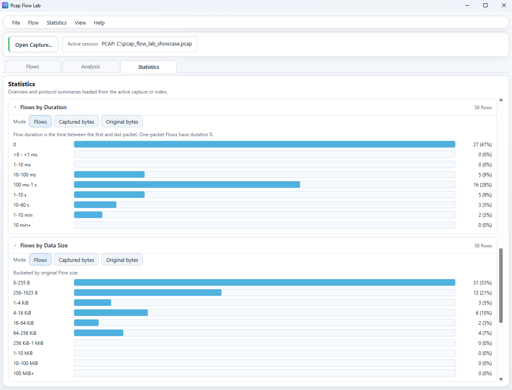

*Flow lifetime and original-data-size distributions, with shared display modes
for Flow count, captured bytes, and original bytes.*

## IP Fragmentation

`IP Fragmentation` summarizes capture-wide IP fragmentation counters.

Fragmented packet percentages use effective IP/family totals. Initial and
non-initial percentages use all fragmented IP packets. Flow percentage uses all
Flows.

Current rows include:

- fragmented IP packets;
- IPv4 fragmented packets;
- IPv6 fragmented packets;
- initial fragments;
- non-initial fragments;
- IPv6 atomic fragments;
- Flows containing fragments.

IPv6 atomic fragments are reported separately from real IPv6 fragmentation.
This section reports capture-level fragmentation facts. It does not report IP
reassembly success or failure.

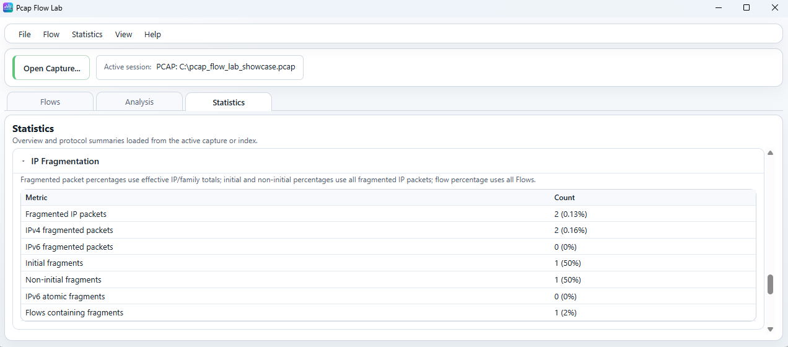

*Capture-wide IP fragmentation counters, including IPv6 atomic fragments and
Flows containing fragments.*

## Protocol Path Tree

`Protocol Path Tree` is the most structurally rich Statistics section.

It aggregates recognized Flows by their stored Protocol Path and lets
you pivot back into `Flows` using structured Protocol Path filtering.

Current columns are:

- `Layer` or `Path`
- `Flows`
- `Packets`
- `Original Bytes`

Depending on the mode, rows can be:

- expandable prefix-tree nodes;
- exact identifier-aware prefix nodes;
- full terminal paths.

### Percentages and aggregation

Protocol Path Tree percentages do not all use the same denominator.

Current denominators:

- `Flows` percentage uses total recognized Flow count included in
  Protocol Path statistics.
- `Packets` percentage uses whole-capture total packet count, so packet shares
  stay comparable even when some packets are unrecognized and intentionally
  excluded from the Protocol Path rows.
- `Original Bytes` percentage uses the total original-byte sum of recognized
  Flows included in Protocol Path statistics.

Important inclusion rules:

- unrecognized packets are excluded from Protocol Path rows;
- only recognized Flows with stored Protocol Paths contribute;
- prefix-tree modes are not mutually exclusive categories, because one flow can
  contribute to multiple prefix rows along its path;
- `Original Bytes` uses Flow original-byte totals.

### Kind overview

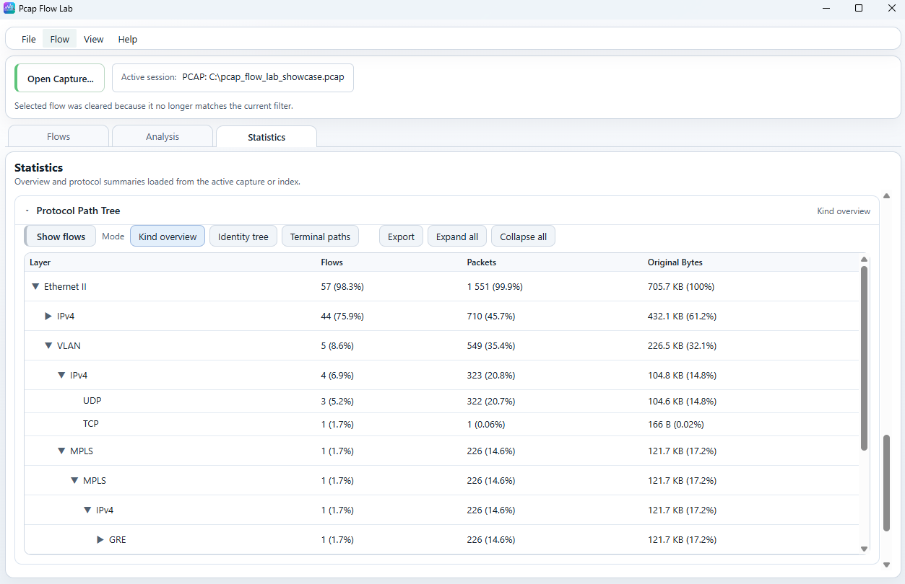

*Kind-only Protocol Path prefix tree.*

`Kind overview` groups by protocol-layer kind while preserving path order.

At user level, that means identifier-bearing variants are normalized to their
kind-only form. For example:

- `VLAN (VID 300)` and `VLAN (VID 320)` both contribute under `VLAN`;
- identity-bearing transport overlays still remain in their path position.

This mode is useful when you want to understand overall layering structure
without splitting rows by identifiers such as VIDs, labels, VNIs, or TEIDs.

### Identity tree

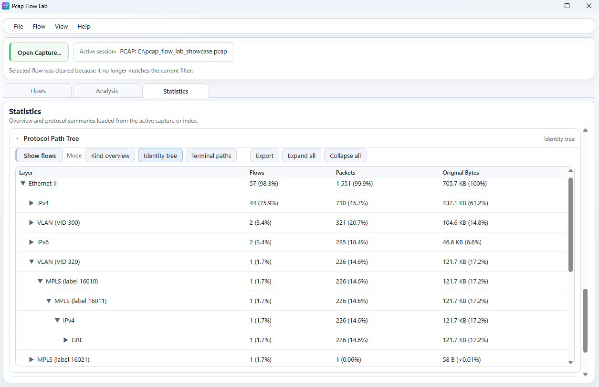

*Identifier-aware Protocol Path prefix tree.*

`Identity tree` keeps identifier-bearing path detail where the current Protocol
Path model stores it.

Examples visible in the showcase capture include:

- `VLAN (VID 300)`
- `VLAN (VID 320)`
- `MPLS (label 16010)`
- `MPLS (label 16011)`

This mode is useful when you want to distinguish traffic that would collapse
together in `Kind overview`.

### Terminal paths

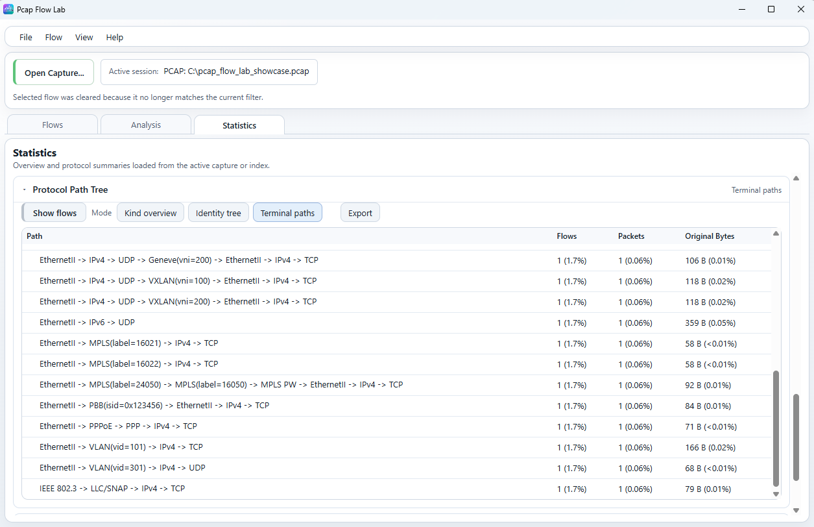

*Complete stored terminal paths rather than expandable prefix rows.*

`Terminal paths` shows complete stored Protocol Paths as flat terminal rows.

Each row represents one full stored path, for example a complete encapsulation
stack from outer transport down to the final inner transport path.

Current semantics:

- rows are full terminal paths, not prefix rows;
- there are no expandable parent nodes in this mode;
- each row aggregates flows sharing the same complete stored terminal path;
- identity-bearing path text remains visible in the terminal-path label.

### Expand and Collapse

`Expand all` and `Collapse all` are available in the two tree modes:

- `Kind overview`
- `Identity tree`

They are intentionally not shown in `Terminal paths`, because that mode is a
flat list of full paths rather than an expandable tree.

### Show matching flows

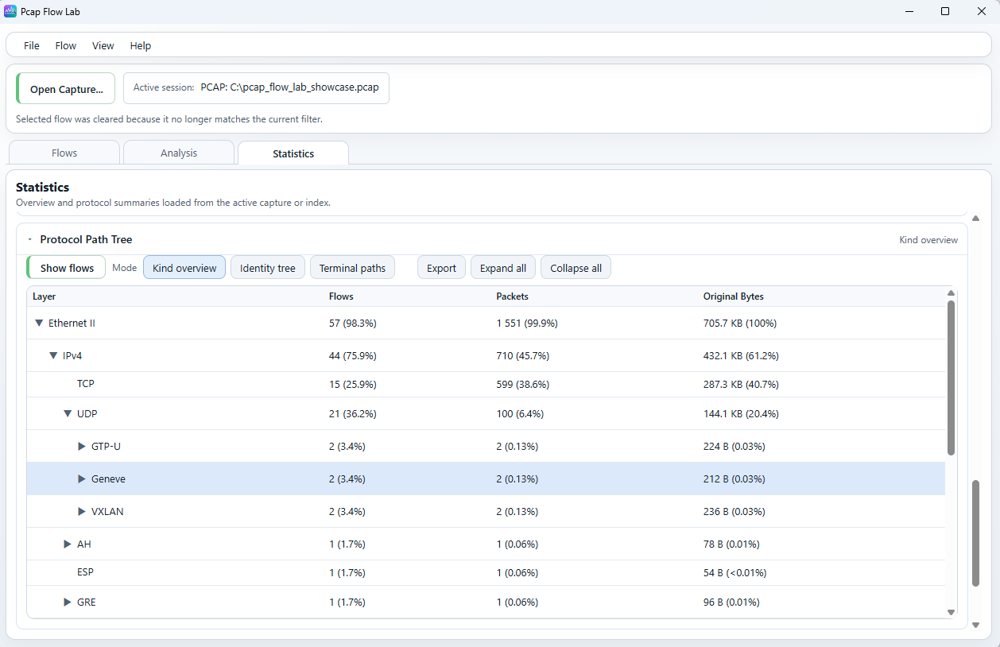

*A selected Protocol Path row can pivot into the Flows workspace.*

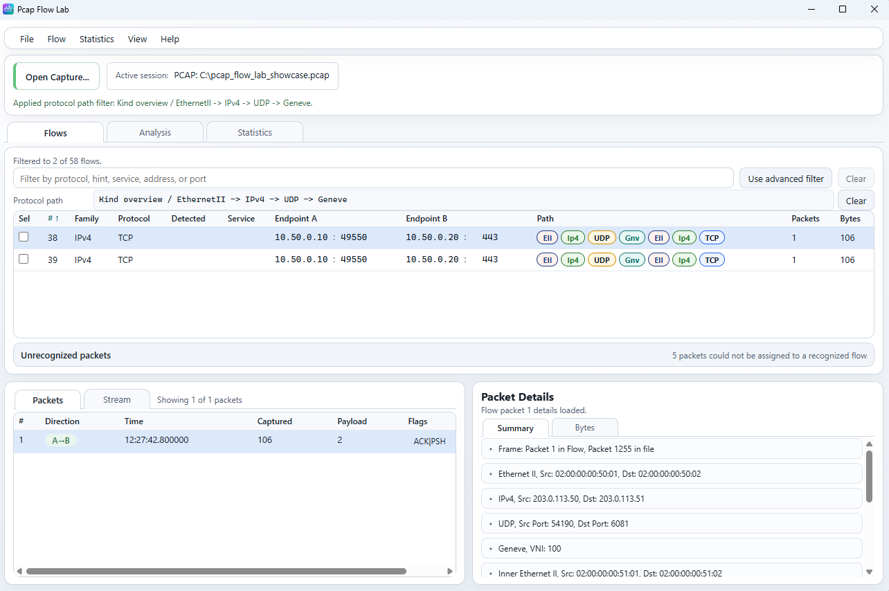

*The selected Protocol Path becomes a structured filter in Flows rather than a
plain text search string.*

`Show flows` is the main interactive bridge from Statistics back to Flows.

When you select a Protocol Path row and activate `Show flows`, the application:

- switches to `Flows`;
- applies a structured Protocol Path filter;
- limits the visible Flow inventory to the matching Flows;
- keeps the primary Flow filter controls as separate controls.

Mode-specific matching semantics:

- `Kind overview` filters by the selected kind-only prefix semantics.
- `Identity tree` filters by the selected identifier-aware prefix semantics.
- `Terminal paths` filters by the selected exact full terminal path.

This is not implemented as text injected into the normal text search box.

The structured Protocol Path restriction and the primary Flow filter can both
apply at the same time:

- the Protocol Path filter restricts the allowed Flow set;
- the active primary filter still narrows that already filtered visible set;
- clearing the Protocol Path filter removes only the structured Protocol Path
  restriction, not the independent primary filter.

If the primary Flow filter is an active Simple Filter or Advanced Flow Filter,
the Statistics Protocol Path restriction intersects that existing filter. The
Statistics Protocol Path restriction is not itself the primary Flow filter.
For structured Protocol Path rules in the primary filter, see
[Advanced Flow Filter](advanced-flow-filter.md).

### Export

`Export` writes the current Protocol Path Tree mode as a plain-text report.

Current export behavior:

- export uses the current mode (`Kind overview`, `Identity tree`, or
  `Terminal paths`);
- output is a text file, not a CSV file;
- the file starts with a mode header and then writes aligned columns:
  `Layer`, `Flows`, `Packets`, `Original Bytes`;
- mode-specific identifiers are preserved according to the selected mode;
- export is mode-based, not driven by the current visual expand/collapse state.

## Detected Protocol Hints

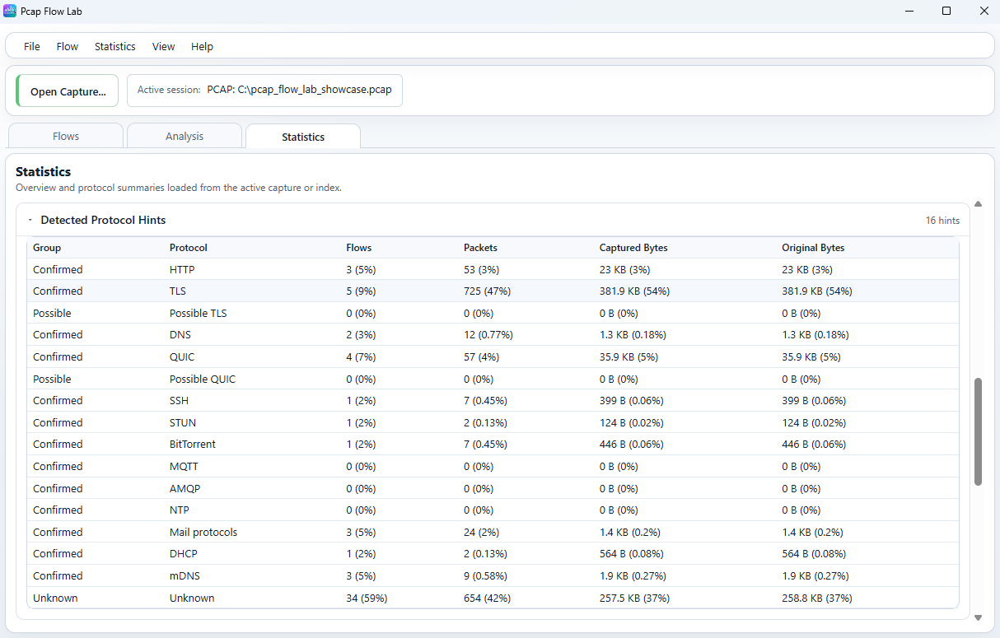

*Capture-wide detected-protocol hint distribution.*

`Detected Protocol Hints` groups recognized Flows by detected
protocol-hint classification.

Current columns:

- `Group`
- `Protocol`
- `Flows`
- `Packets`
- `Captured Bytes`
- `Original Bytes`

Current group meanings:

- `Confirmed`
- `Possible`
- `Unknown`

The screenshot shows a useful example mix, but it is not a fixed exhaustive
protocol list.

User-facing interpretation:

- `Confirmed` means the current product assigned a concrete detected protocol
  hint.
- `Possible` is a heuristic category used only where the current product
  supports that possibility class.
- `Unknown` means no specific detected protocol hint was assigned.

This is Flow-level hint metadata. A detected or possible protocol hint does not
guarantee full packet dissection, Stream parsing, or service metadata for every
matching Flow.

Current percentage denominators are internal to this section:

- flow percentages use the total flow count across all hint rows in this
  section;
- packet percentages use the total packet count across all hint rows in this
  section;
- captured-byte percentages use total captured bytes across all hint rows;
- original-byte percentages use total original bytes across all hint rows.

## Capture Metrics

`Capture Metrics` is a collapsible section that summarizes packet-level and
flow-workload properties derived from the whole surfaced capture:

- `Average Captured Packet Size`
- `Average Original Packet Size`
- `Average packets per flow`
- `Flows per 1M packets`
- `Average Packet Rate`
- `Average Captured Data Rate`
- `Average Original Data Rate`
- `Truncated Packets`
- `Not Captured Bytes`
- `Capture Completeness`

Current semantics:

- average packet sizes divide captured/original byte totals by surfaced packet
  count when at least one packet is present;
- `Average packets per flow` divides surfaced packet count by user-visible Flow
  count;
- `Flows per 1M packets` normalizes user-visible Flow count to one million
  surfaced packets;
- packet and data rates use capture duration, so a valid zero-duration
  one-packet capture still shows rate fields as unavailable rather than
  `inf`/`NaN`;
- data rates are byte-based values per second, not bits per second;
- `Truncated Packets` shows both count and share of surfaced packets;
- `Not Captured Bytes` is `Original Bytes - Captured Bytes` clamped at zero;
- `Capture Completeness` is the captured/original byte ratio when original-byte
  totals are non-zero.

`Not Captured Bytes` reflects truncation or capture-incompleteness semantics in
the imported data. It is not a network packet-loss measurement.

## Flow Characteristics

`Flow Characteristics` is a collapsible section that currently reports:

- `Only A -> B Flows`
- `Service Recognized`

Current semantics:

- `Only A -> B Flows` means flows whose first-observed `A -> B` direction has
  packets while the reverse `B -> A` direction has none;
- `Service Recognized` means the stored Flow has a non-empty service
  hint;
- both values are shown as count plus percentage of recognized Flows.

## Direction Distribution

`Direction Distribution` is one collapsible section containing two separate
tables:

- `Packet Direction`
- `Data Direction (Original Bytes)`

Both tables use the same three direction groups:

- `Mostly A -> B`
- `Balanced`
- `Mostly B -> A`

Each row shows:

- `Flows`
- `Percent`

Percentages use the recognized Flow total as the denominator.

`Data Direction (Original Bytes)` is based on ORIGINAL bytes, not captured
bytes. Its helper text explains that flows are grouped by directional
original-byte balance.

## TCP Flags

`TCP Flags` is a separate collapsible whole-capture section that summarizes
TCP packets by control-flag presence.

Current rows:

- `SYN`
- `FIN`
- `RST`

Each row shows:

- `Packets`
- `Percent`

Current semantics:

- counts come from the imported capture/index session's authoritative Flow
  aggregates rather than by rescanning packet details;
- percentages use the whole-capture TCP packet total as the denominator, not
  all packets in the file;
- `SYN` includes `SYN+ACK`;
- one packet can contribute to more than one row when multiple TCP flags are
  set.

This section is a compact control-flag summary only. It does not by itself
interpret full handshake success/failure or TCP state transitions.

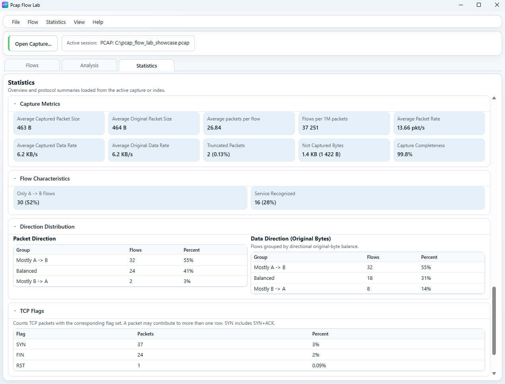

*Capture-wide derived metrics, Flow characteristics, directional balance, and
TCP control-flag counts.*

## QUIC and TLS

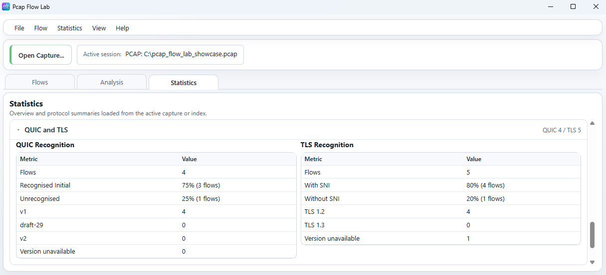

*Capture-wide QUIC Initial recognition, QUIC version, TLS SNI, and TLS version
statistics.*

`QUIC and TLS` summarizes recognition-quality and metadata-coverage statistics
for QUIC and TLS Flows.

### QUIC recognition

Current QUIC fields:

- `Flows`
- `Recognized Initial`
- `Unrecognized`
- `v1`
- `draft-29`
- `v2`
- `Version unavailable`

Current semantics:

- all counts here are flow counts, not packet counts;
- `Recognized Initial` and `Unrecognized` are percentages of total QUIC flows;
- version rows count QUIC flows by recognized version classification.
- These are recognition/version metadata counters and do not imply QUIC session
  reconstruction or application-data decryption.

### TLS recognition

Current TLS fields:

- `Flows`
- `With SNI`
- `Without SNI`
- `TLS 1.2`
- `TLS 1.3`
- `Version unavailable`

Current semantics:

- all counts here are flow counts, not packet counts;
- `With SNI` and `Without SNI` are percentages of total TLS flows;
- version rows count TLS flows by recognized version classification.
- These are recognition/version metadata counters and do not imply full TLS
  session reconstruction or decryption.

## Top Flows by Original Bytes

`Top Flows by Original Bytes` is a separate collapsible whole-capture section
shown near the bottom of `Statistics`, immediately before `Top Endpoints and
Ports`.

Current columns:

- `Flow`
- `Endpoint A`
- `Endpoint B`
- `Protocol`
- `Detected Protocol`
- `Service`
- `Protocol Path`
- `Packets`
- `Captured`
- `Original`

Current ranking semantics:

- rows are ranked by `Original` bytes descending;
- packet count is the secondary tie-breaker;
- Flow order is the final deterministic tie-breaker.

Current row semantics:

- `Flow` uses the same one-based visible numbering as the normal `Flows` list;
- `Endpoint A` / `Endpoint B` preserve the first-observed orientation;
- `Protocol` matches the flow-list transport/protocol column;
- `Detected Protocol` reuses the current shared `Possible TLS` / `Possible
  QUIC` presentation policy;
- `Service` shows the stored service hint and uses `—` when the Flow
  has no stored service hint;
- `Protocol Path` shows the same compact path representation used by the normal
  `Flows` list;
- `Captured` and `Original` are metadata-backed flow totals, but ranking still
  follows `Original`.

This section keeps at most `10` rows.

## Top Endpoints and Ports

The following section shows:

- `Top Endpoints`
- `Top Ports`

Current columns:

- `Flows`
- `Packets`
- `Original Bytes`

Current ranking semantics:

- both tables rank by original bytes descending;
- packet count is the secondary tie-breaker;
- endpoint or port text is the final deterministic tie-breaker.

Current endpoint semantics:

- each row counts distinct Flows involving that endpoint;
- each recognized Flow contributes its full packet count and original-
  byte total to both of its endpoints;
- endpoint packet totals therefore count packets involving that endpoint across
  all matching flows.

Current port semantics:

- each row counts distinct Flows involving that non-zero port number;
- each recognized Flow contributes its full packet count and original-
  byte total to both non-zero endpoint ports;
- one Flow contributes once per DISTINCT non-zero port number, so a
  `4500 -> 4500` flow counts once for port `4500`, not twice;
- protocols without ports do not add port rows.

Current UI shape:

- the section shows top `5` rows in each table;
- in the current desktop UI it is shown only when the active capture or index
  has more than `30` flows.

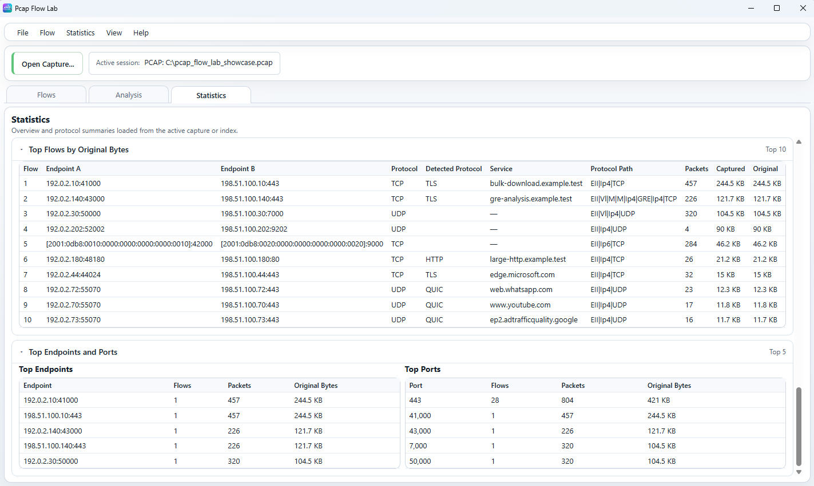

*Top Flows by original bytes, followed by whole-capture endpoint and port
rankings.*

## Export Statistics

Both desktop frontends expose full Statistics report export from the main menu:

- `Statistics -> Export Statistics as HTML...`
- `Statistics -> Export Statistics as Markdown...`

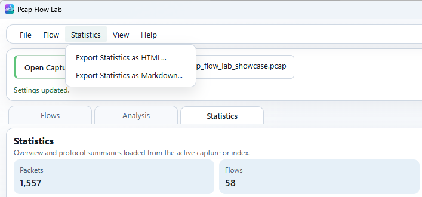

*Qt and Tauri expose whole-session Statistics export from the Statistics menu.*

These actions build a complete whole-session Statistics report using the shared
backend Statistics/report model. Export is not a screenshot of the visible
Statistics page, and it does not depend on which live collapsible sections are
currently expanded. The report is structured content suitable for later review
or sharing.

The report may represent data differently from the live workspace and can
include report/CLI-oriented sections. In particular, `Capture Import Settings`
is currently report/CLI-only rather than a live Qt/Tauri Statistics section.
It records the import-time provenance stored with the capture or index, such
as Flow-grouping import options, not the user's current mutable runtime
Settings. For user-editable Settings, see [Settings](settings.md).
Examples include whether VLAN/MPLS layers or GTP-U TEIDs were ignored for Flow
grouping at import time.

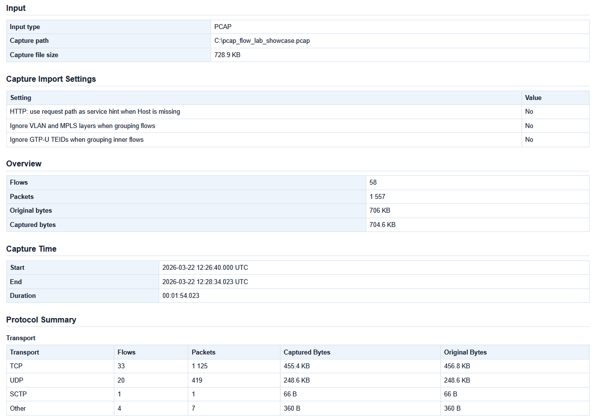

*The HTML report includes whole-session Statistics and report-only provenance
such as Capture Import Settings.*

Current full Statistics reports include the main shared Statistics areas:

- report information and input/source identity;
- Capture Import Settings;
- capture overview and capture time;
- transport and IP family summaries;
- unrecognized packet totals;
- packet size distribution;
- Flows by Packet Count;
- Flows by Duration;
- Flows by Data Size;
- IP Fragmentation;
- Detected Protocol Hints;
- Capture Metrics;
- Flow Characteristics;
- Direction Distribution;
- TCP Flags;
- QUIC and TLS;
- Top Flows by Original Bytes;
- Top Endpoints and Ports;
- Protocol Path statistics in Identity tree form.

Use HTML when you want a formatted standalone report that is convenient to open
in a browser. Use Markdown when you want text-oriented output for technical
notes, issue reports, source-controlled investigations, or external processing.
Reports are useful for attaching a capture summary to an investigation,
preserving a human-readable Statistics snapshot, comparing captures externally,
or sharing the HTML output with someone who does not need the raw capture.

### Raw capture and index export

Statistics report export works from an opened raw capture and from compatible
Pcap Flow Lab indexes. For compatible indexes containing current Statistics
data, summary-style report generation can use the index's fast Statistics
tier. That path does not need source packet bytes merely to export Statistics
and does not probe the recorded source capture just to check whether it is
currently accessible.

Byte-backed workflows such as Packet Details `Bytes` or Stream item data still
have their own source-byte requirements. Statistics report export is
metadata/statistics-backed.

### CLI equivalent

The CLI `summary` command can write the same shared Statistics report formats:

```text
pcap-flow-lab summary capture.idx --out-statistics-html statistics.html --out-statistics-markdown statistics.md
```

The relevant options are:

- `--out-statistics-html <path>`
- `--out-statistics-markdown <path>`

See [CLI summary](../cli/summary.md) for full command syntax, overwrite rules,
and raw-capture versus index behavior.

## Raw captures and indexes

Statistics is designed to work for both:

- an active raw capture; and
- a previously created Pcap Flow Lab index.

Statistics is metadata/statistics-backed and does not require selected-packet
byte materialization. It does not follow the same source-byte reattachment
constraints as packet-bytes or stream-item-data inspection.

## Related documentation

- [Main window](main-window.md)
- [Flows workspace](flows.md)
- [Analysis workspace](analysis.md)
